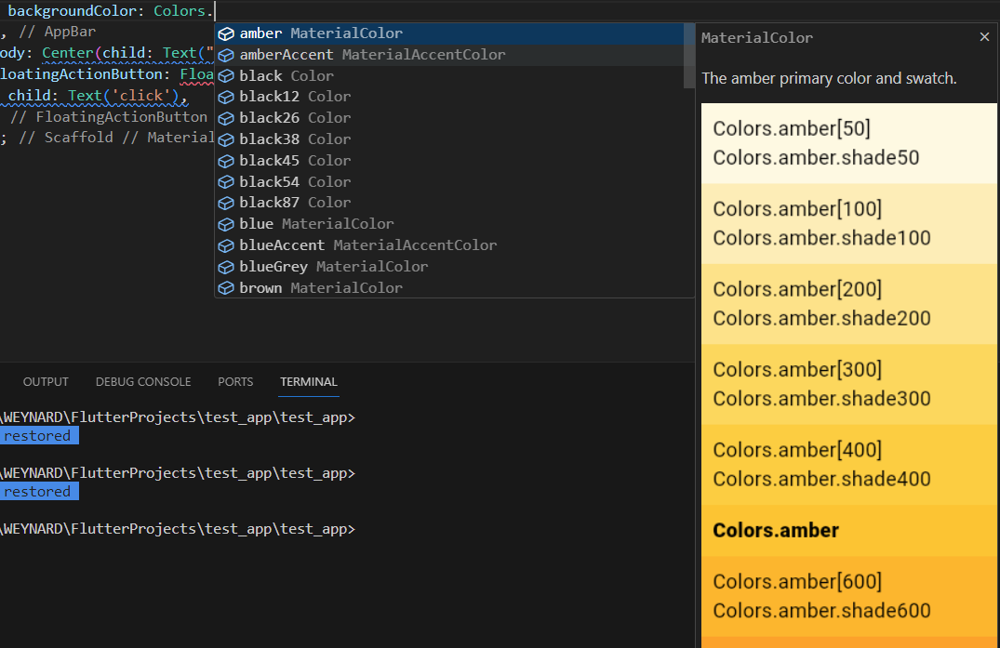
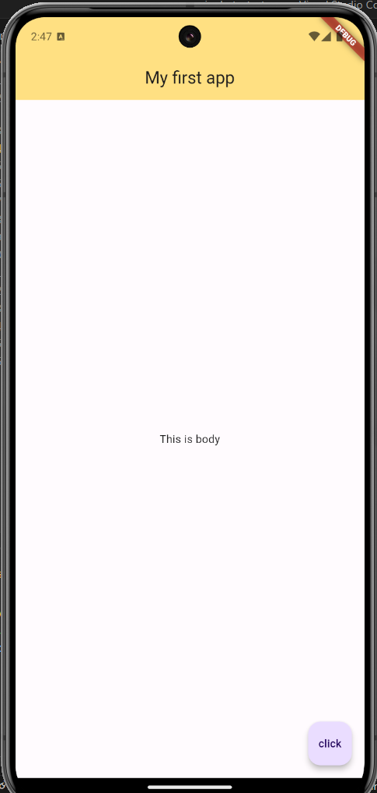
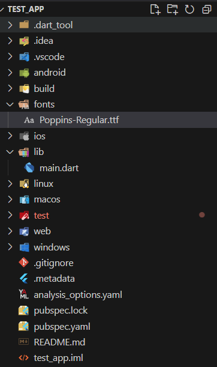
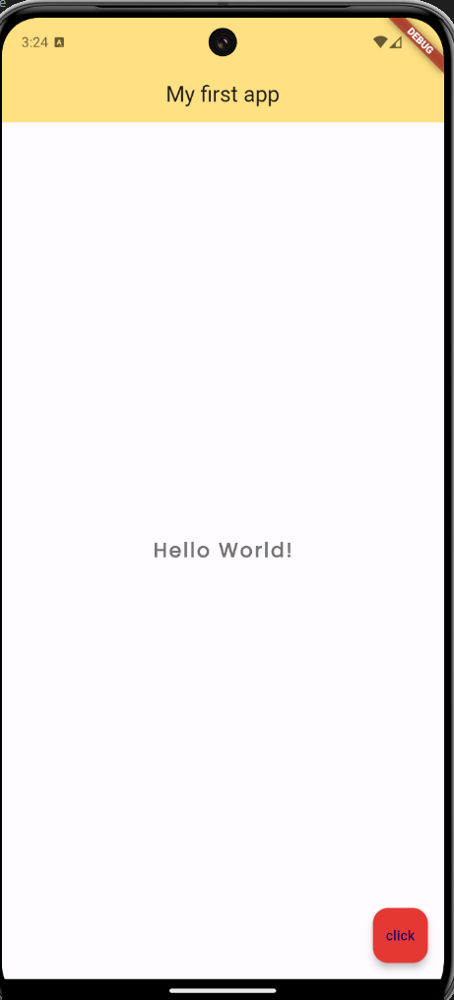

# Colors & Font

[Back](README.md)

## Content Overview

- [Colors & Font](#colors--font)
  - [Colors](#colors)
  - [Font](#font)
  - [Custom Font Family](#custom-font-family)

### Colors

Previously, we used the default colors from the Material Design app.

```dart
void main() {
  runApp(MaterialApp(
      home: Scaffold(
    appBar: AppBar(
      title: Text("My first app"),
      centerTitle: true,
    ),
    body: Center(child: Text("This is body")),
    floatingActionButton: FloatingActionButton(
      child: Text('click'),
    ),
  )));
}
```

Based on the previous code, let's change the AppBar background color using the `backgroundColor` property of the AppBar widget. Then, we can set the color using `Colors.`, which will show various available colors.



As shown (for example, the Amber color), there are different shades ranging from 50, 100, 200, etc. This allows us to select the specific shade we want. The example code is as follows:

```dart
AppBar(
      title: Text("My first app"),
      centerTitle: true,
      backgroundColor: Colors.amber[200]
    ),
```



We can also change the color of the `FloatingActionButton`:

```dart
FloatingActionButton(
    onPressed: () {},
    child: Text('click'),
    backgroundColor: Colors.red[600],
)
```

For more details about colors, refer to the following link:
[Flutter Colors API Reference](https://api.flutter.dev/flutter/material/Colors-class.html)

If you want to use a custom hex color code, you can use the `Color()` widget:

```dart
Color(0xFF42A5F5)
```

### Font

Besides applying colors to widgets like the AppBar and buttons, we can also modify the font style of text using the `Text` widget. This can be done using the `TextStyle` widget, which is applied through the `style` property of `Text`.

```dart
Text(
    'Hello World!',
    style: TextStyle(
        fontSize: 20.0,
        fontWeight: FontWeight.bold,
        letterSpacing: 2.0,
        color: Colors.grey[600],
    ),
)
```

Some properties we can adjust include font size (`fontSize`), font weight (`fontWeight`), letter spacing (`letterSpacing`), and color (`color`).


#### Custom Font Family

We can change the text font family to a custom one. First, download a font. A good source is [Google Fonts](https://fonts.google.com/). After downloading the font, move it into your Flutter project by creating a `/fonts` folder.



To let Flutter recognize the font, we need to configure the `pubspec.yaml` file by adding the following code (be mindful of whitespace formatting):

```yaml
fonts:
  - family: Poppins
    fonts:
      - asset: fonts/Poppins-Regular.ttf
```

When saved, `flutter pub get` will automatically run to update dependencies, including the new font family. Now, we can use `Poppins` in the `fontFamily` property of `TextStyle`:

```dart
Text(
    'Hello World!',
    style: TextStyle(
        fontSize: 20.0,
        fontWeight: FontWeight.bold,
        letterSpacing: 2.0,
        color: Colors.grey[600],
        fontFamily: 'Poppins'
    ),
)
```

The end result should be as follows.


