# Creating a Flutter App

[Back](README.md)

After installing Flutter in [01. Introduction & Setup](s/01.%20Introduction%20&%20Setup/), we can start creating our first Flutter application. There are two IDEs (Integrated Development Environments) that can be used to build a Flutter app: Android Studio and Visual Studio Code.

## Android Studio

Android Studio is a popular IDE for mobile app development. After installing [Android Studio](https://developer.android.com/studio?gad_source=1&gclid=Cj0KCQiA2oW-BhC2ARIsADSIAWoAPGSFYZetK8lZ7chW-gRH1ND2PYcij3Ty7qLUqhh3ljrh3Oc-4DoaAo2qEALw_wcB&gclsrc=aw.ds), its interface will look like this:

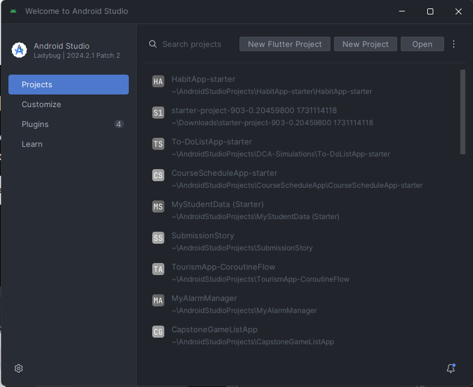

### 1. Creating a Virtual Device

One option to preview the application interface is by using a Virtual Device (Emulator). The first step is to find the **Virtual Device Manager** menu as shown below:

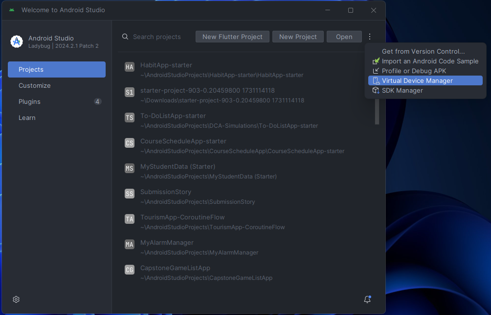

Then, we will add a new Virtual Device by selecting the **Create Virtual Device** option.

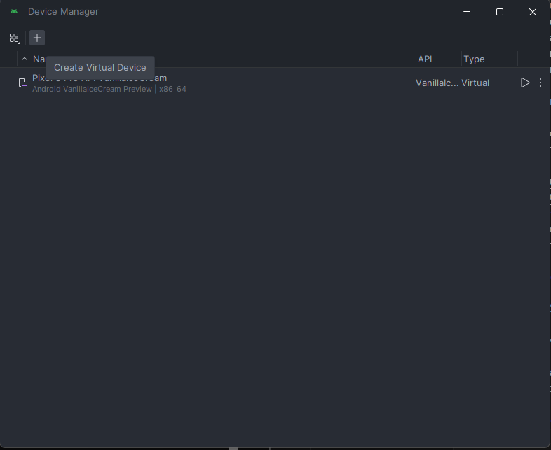

Next, choose the appropriate phone hardware based on your needs.

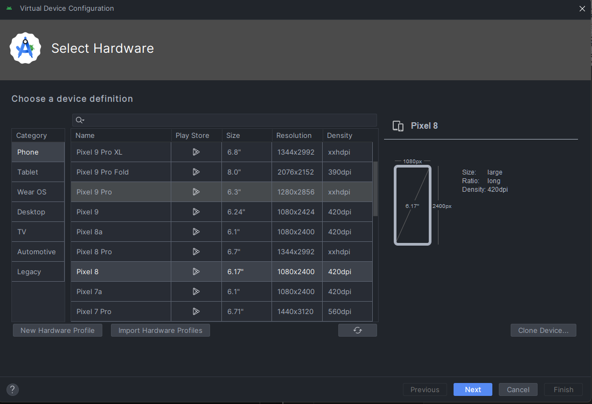

Then, select the Android OS version.

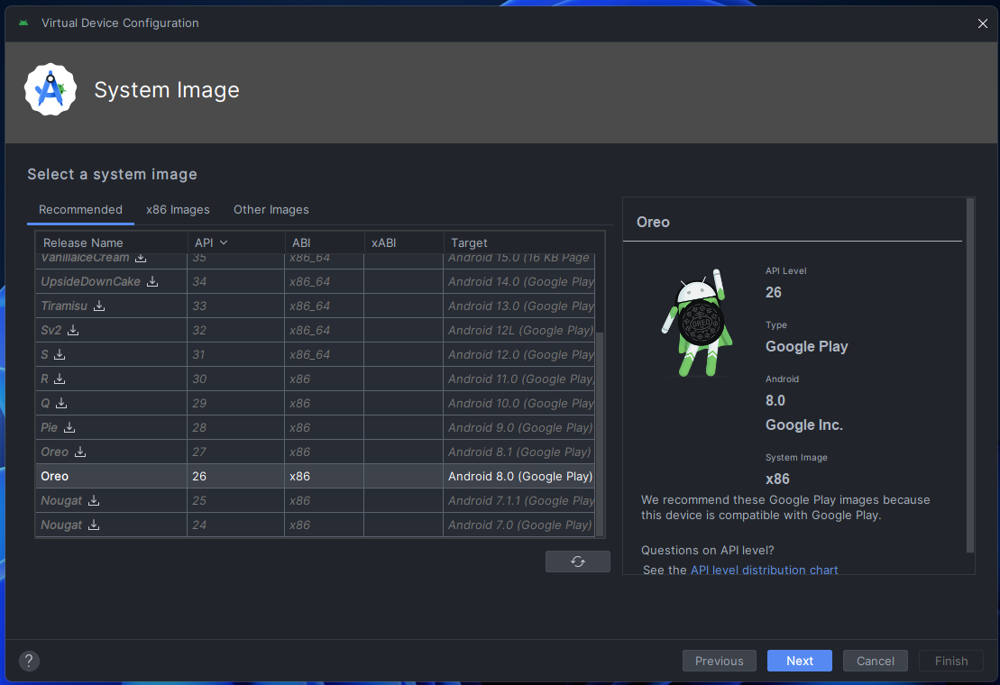

Finally, name your Android Virtual Device and press **Finish**.

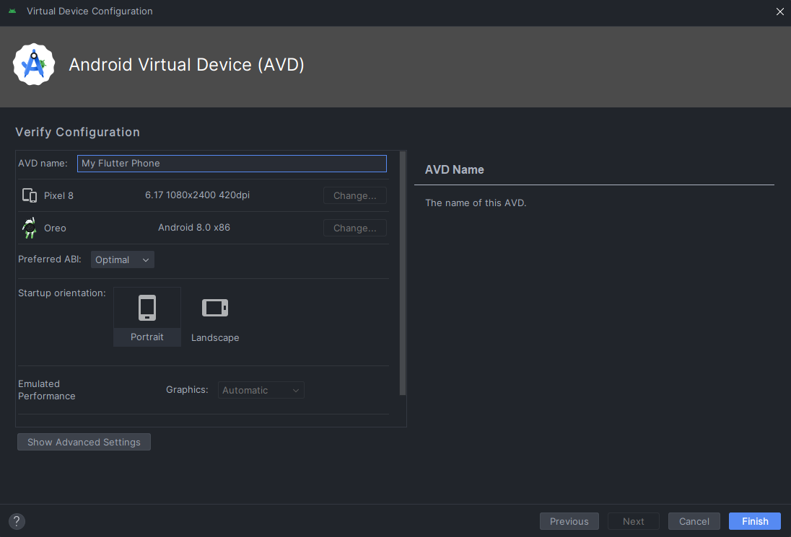

Once the Virtual Device setup is complete, it will be ready for use as an emulator.

### 2. Installing the Flutter Plugin

The next step is to install the Flutter Plugin in Android Studio to enable Flutter development. Navigate to the **Plugins** page → Marketplace → Search for `Flutter`.

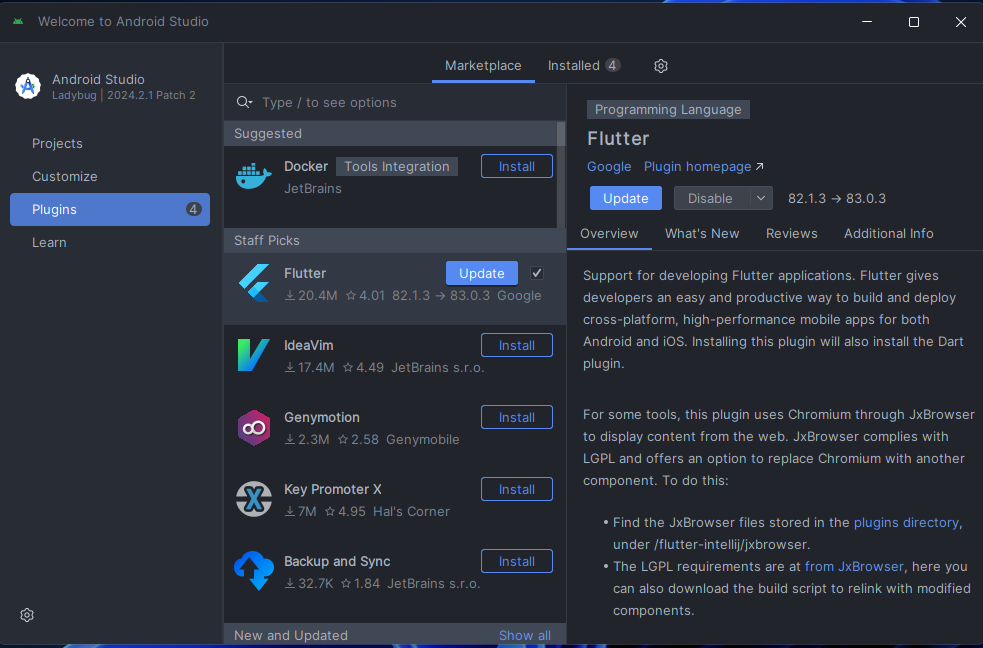

Install the plugin so that the `New Flutter Project` option appears.

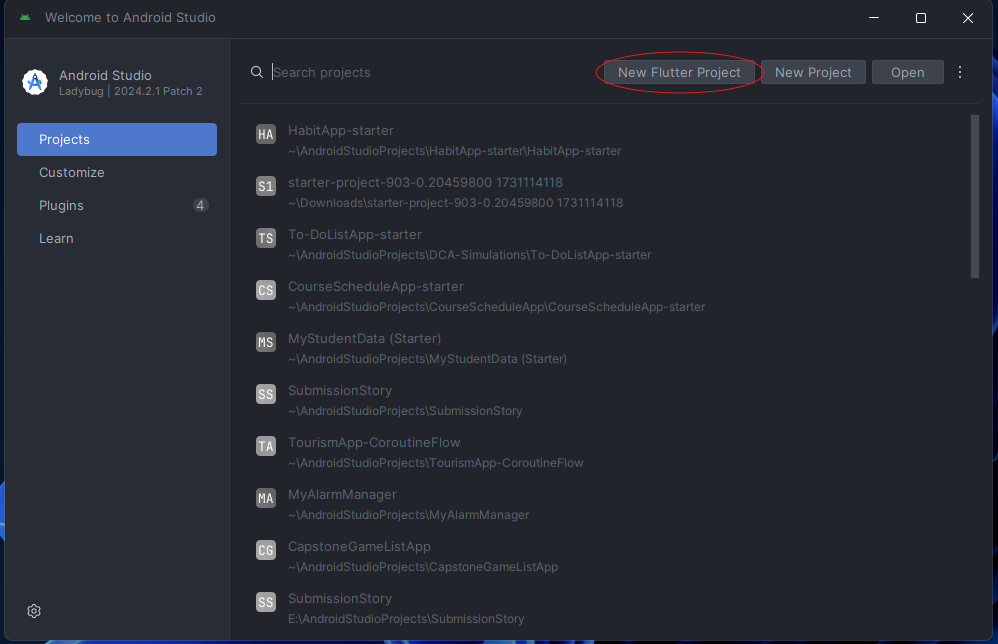

### 3. Starting a Flutter Application

You can create your first Flutter application by selecting **New Flutter Project**.

Then, locate the previously installed Flutter SDK.

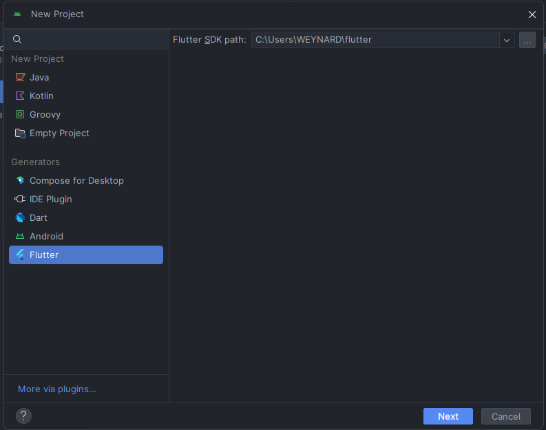

Next, configure the `Project Name`, `Project Location`, `Description`, and `Organization Name`.

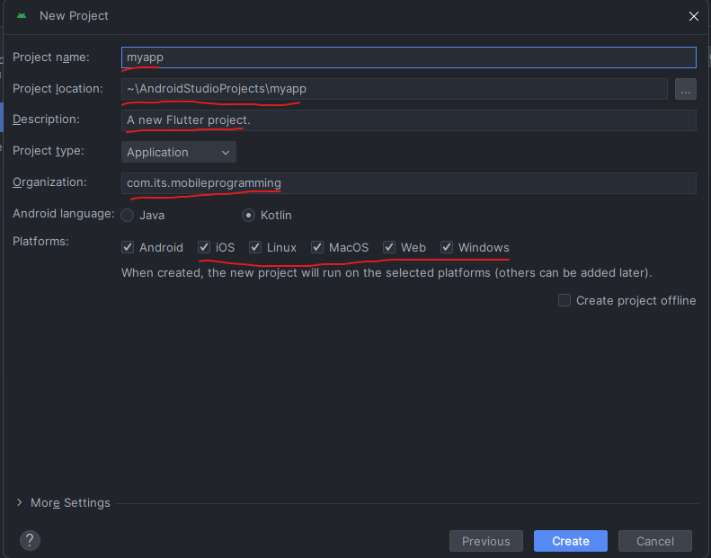

Once everything is set up, the editor interface will appear as follows:

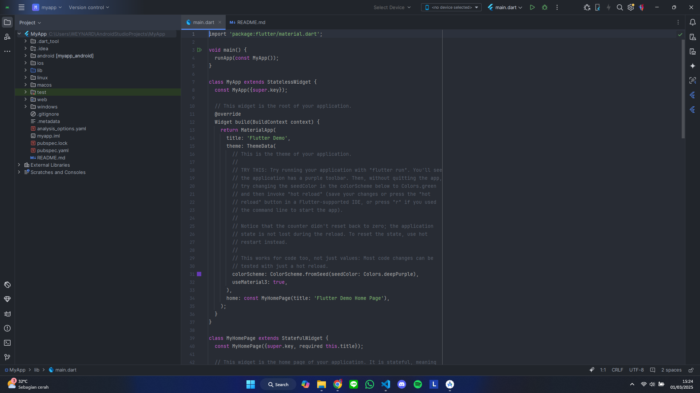

## Visual Studio Code
