# Creating a Flutter App

[Back](README.md)

## Content Outline

- [Creating a Flutter App](#creating-a-flutter-app)
  - [Android Studio](#android-studio)
    - [1. Creating a Virtual Device](#1-creating-a-virtual-device)
    - [2. Installing the Flutter Plugin](#2-installing-the-flutter-plugin)
    - [3. Starting a Flutter Application](#3-starting-a-flutter-application)
    - [4. Run the Project](#4-run-the-project)
  - [Visual Studio Code](#visual-studio-code)
    - [1. Starting a Flutter Application](#1-starting-a-flutter-application)
  - [First program](#first-program)
  - [Note](#note)

After installing Flutter in [01. Introduction & Setup](s/01.%20Introduction%20&%20Setup/), we can start creating our first Flutter application. There are two IDEs (Integrated Development Environments) that can be used to build a Flutter app: Android Studio and Visual Studio Code.

## Android Studio

Android Studio is a popular IDE for mobile app development. After installing [Android Studio](https://developer.android.com/studio?gad_source=1&gclid=Cj0KCQiA2oW-BhC2ARIsADSIAWoAPGSFYZetK8lZ7chW-gRH1ND2PYcij3Ty7qLUqhh3ljrh3Oc-4DoaAo2qEALw_wcB&gclsrc=aw.ds), its interface will look like this:


### 1. Creating a Virtual Device

One option to preview the application interface is by using a Virtual Device (Emulator). The first step is to find the **Virtual Device Manager** menu as shown below:


Then, we will add a new Virtual Device by selecting the **Create Virtual Device** option.


Next, choose the appropriate phone hardware based on your needs.


Then, select the Android OS version.


Finally, name your Android Virtual Device and press **Finish**.


Once the Virtual Device setup is complete, it will be ready for use as an emulator.

### 2. Installing the Flutter Plugin

The next step is to install the Flutter Plugin in Android Studio to enable Flutter development. Navigate to the **Plugins** page → Marketplace → Search for `Flutter`.


Install the plugin so that the `New Flutter Project` option appears.


### 3. Starting a Flutter Application

You can create your first Flutter application by selecting **New Flutter Project**.


Then, locate the previously installed Flutter SDK.


Next, configure the `Project Name`, `Project Location`, `Description`, and `Organization Name`.


Once everything is set up, the editor interface will appear as follows:


#### 4. Run the Project

We need to start up the emulator by pressing play button on `Device Manager`

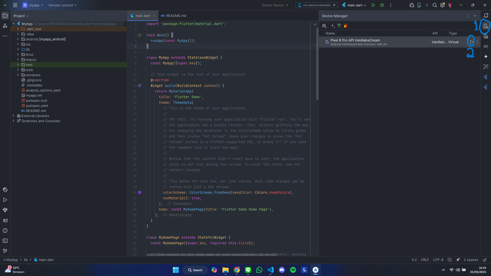

We can try to run project by pressing the play green button on the top right or next to `main()` function.

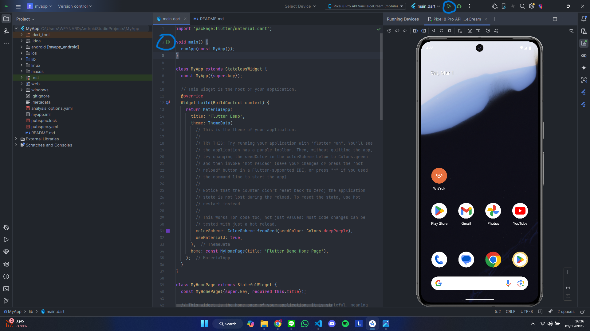

The application will be shown as follows

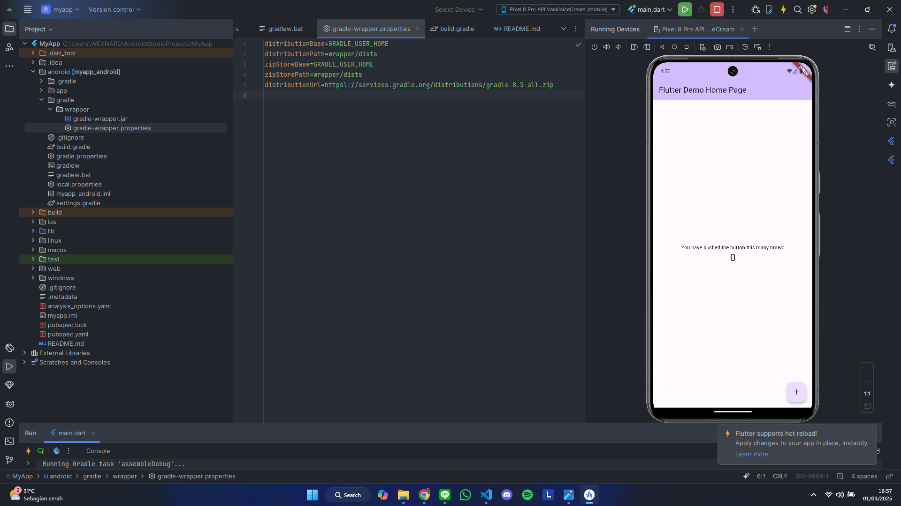

## Visual Studio Code

### 1. Starting a Flutter Application

In Visual Studio Code, make sure you have installed the `Flutter` extension.

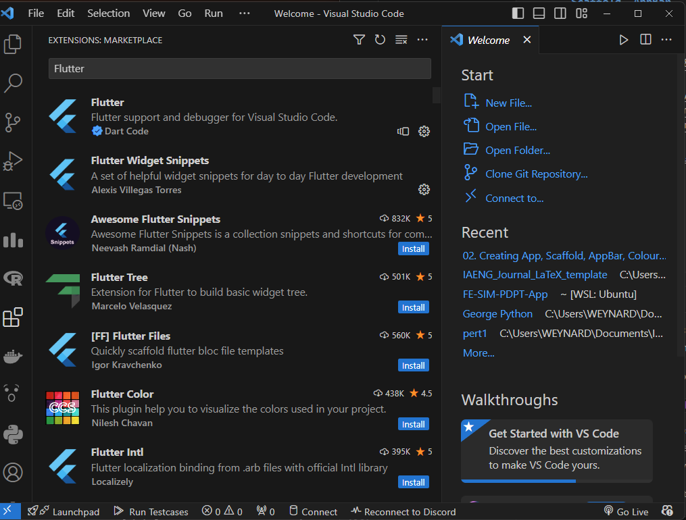

To create a new Flutter project, press `Ctrl + Shift + P` and search for `Flutter: New Project`.

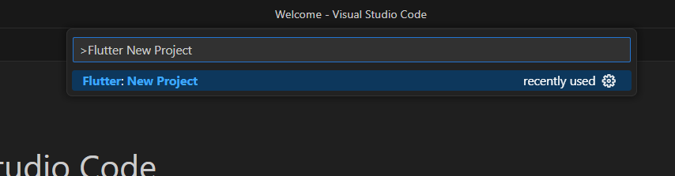

Then, select `Application` and choose the project storage location.

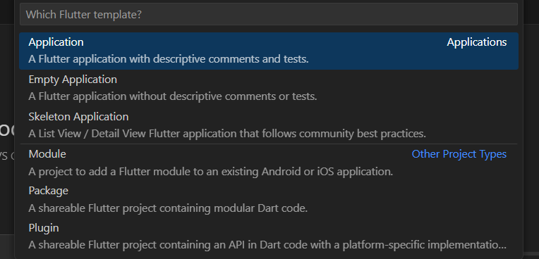

Finally, enter the name of the project you want to create.

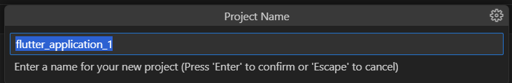

The project structure will be created and displayed as follows:

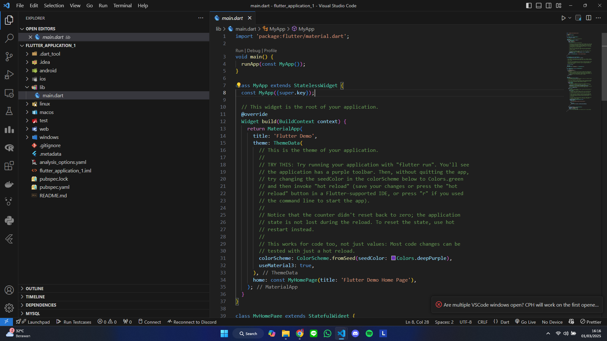

You can see a code snippet that is ready to be tested. However, before running the application, you need an Android phone or an emulator.

One way to set up an emulator is by creating a [Virtual Device](#1-creating-a-virtual-device) in Android Studio. Then, in Visual Studio Code, press `Ctrl + Shift + P` and search for `Flutter: Launch Emulator`.

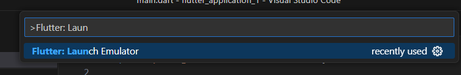

Next, select the emulator you want to use.

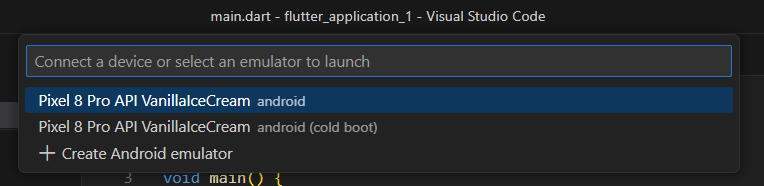

Once launched, the Android Virtual Device emulator will appear.

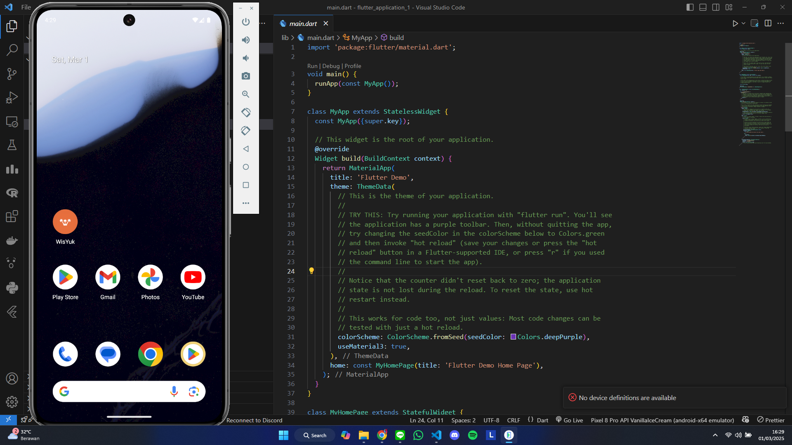

To run the application, you can type `flutter run` in the terminal or press `Run` on the `main()` function. This will install the application on the Android device and display it on the screen.

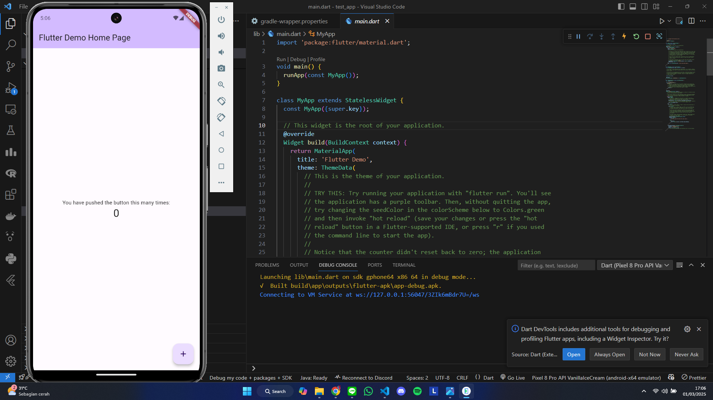

## First Program

Create a simple program by using `void main()` function as follows

```dart
import 'package:flutter/material.dart'; // Material Design package

void main() {
  runApp(MaterialApp(
    home: Text("Hey MOBILE"),
  ));
}
```

We use `runApp` to run application with `MaterialApp` for using its Material Design.
To give a text on our `MaterialApp`, we need to use `Text()` widget. Run and see the result!

## Note

If there is an error while running the application, try change the gradle version on `android\gradle\wrapper\gradle-wrapper.properties` based on the Java version used on Flutter by typing `flutter doctor --verbose` on terminal.

```
distributionUrl=https\://services.gradle.org/distributions/gradle-8.5-all.zip
```

Check the gradle version on
https://docs.gradle.org/current/userguide/compatibility.html#java
