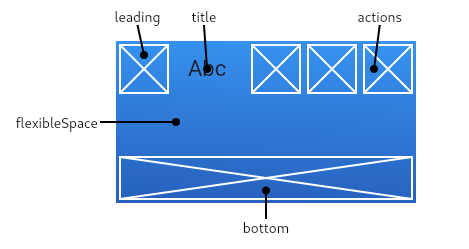
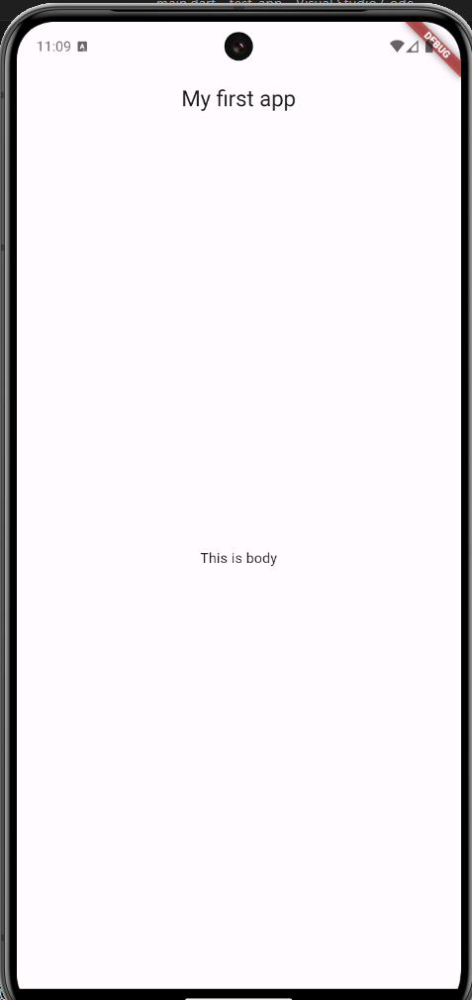
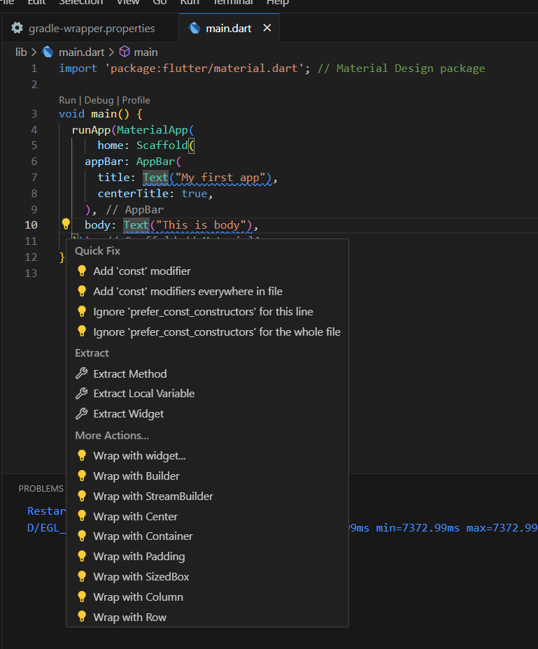

# Scaffold & AppBar Widgets

[Back](README.md)

## Content Overview

- [Scaffold & AppBar Widgets](#scaffold--appbar-widgets)
  - [Scaffold](#scaffold)
    - [AppBar](#appbar)
    - [Body](#body)
    - [Floating Action Button](#floating-action-button)
  - [Tips](#tips)

With the Flutter application ready, we can start to make our application by using widgets. Prepare the program as follows to continue.

```dart
import 'package:flutter/material.dart';

void main() {
  runApp(MaterialApp(
    home: Text("Hey MOBILE"),
  ));
}
```

## Scaffold

Scaffold class widget is a basic Material Design visual layout structure. It allows to setup the AppBar, FloatingActionButton, and more. We can start by using `Scaffold()` on our `MaterialApp()`

```dart
import 'package:flutter/material.dart';

void main() {
  runApp(MaterialApp(
    home: Scaffold(),
  ));
}
```

Reference: https://api.flutter.dev/flutter/material/Scaffold-class.html

We can move on to setup the appbar and the body

### AppBar

We use `appBar` property from Scaffold to setup our AppBar. The value of this `appBar` is an `AppBar` Widget. `AppBar` Widget has some properties like `title`, `leading`, `actions`, and more.



Let's try add AppBar and give title on the AppBar by adding title with a `Text` widget.

```dart
import 'package:flutter/material.dart';

void main() {
  runApp(MaterialApp(
    home: Scaffold(
      appBar: AppBar(
        title: Text('my first app')
      )
    ),
  ));
}
```

Run or restart the program and see how it results. There are other properties for AppBar, like `centerTitle: true` for centering the text.

Reference: https://api.flutter.dev/flutter/material/AppBar-class.html

### Body

There is also `body` property from Scaffold widget for content app. We can put `Text` widget on the body for its content.

```dart
import 'package:flutter/material.dart';

void main() {
  runApp(MaterialApp(
    home: Scaffold(
      appBar: AppBar(
        title: Text('my first app')
      ),
      body: Text("This is body")
    ),
  ));
}
```

What if we have multiple widgets that we want to place in the `body` or configure the content? We can wrap them using widgets such as:

1. Container

A versatile widget that allows you to apply padding, margins, alignment, decoration (such as background color and border), and constraints to its child.

```dart
Container(
  padding: EdgeInsets.all(10),
  color: Colors.blue,
  child: Text("This is body"),
)
```

2. Center

Centers its child widget both vertically and horizontally within the available space.

```dart
Center(
  child: Text("Hello, Flutter!"),
)
```

3. Row

A widget that arranges its children horizontally (from left to right).

```dart
Row(
  mainAxisAlignment: MainAxisAlignment.center,
  children: [
    Text("Hello"),
    SizedBox(width: 10),
    Text("Flutter!"),
  ],
)
```

4. Column

Similar to Row, but arranges its children vertically (from top to bottom).

```dart
Column(
  mainAxisAlignment: MainAxisAlignment.center,
  children: [
    Text("Hello"),
    SizedBox(height: 10),
    Text("Flutter!"),
  ],
)
```

5. Stack

Overlays multiple widgets on top of each other.

6. ListView

A scrollable list of widgets.

7. Expanded/Flexible

Helps distribute space when using Row or Column.

We try center the `Text` by wrapping it up with `Center`, the `Text` is placed inside the child.

```dart
void main() {
  runApp(MaterialApp(
      home: Scaffold(
    appBar: AppBar(
      title: Text("My first app"),
      centerTitle: true,
    ),
    body: Center(child: Text("This is body")),
  )));
}
```

The end result should be as follows



### Floating Action Button

A Material Design floating action button. A floating action button is a circular icon button that hovers over content to promote a primary action in the application. Floating action buttons are most commonly used in the Scaffold.floatingActionButton field.

```dart
void main() {
  runApp(MaterialApp(
      home: Scaffold(
    appBar: AppBar(
      title: Text("My first app"),
      centerTitle: true,
    ),
    body: Center(child: Text("This is body")),
    floatingActionButton: FloatingActionButton(
      child: Text('click'),
    ),
  )));
}
```

## Tips

You can click on the lamp icon to wrap content automatically

