# 03. Widgets - Images, Buttons, Icons, Containers & Padding, Rows, Columns

[Previous](/02.%20Creating%20App,%20Scaffold,%20AppBar,%20Colours,%20Fonts/) | [Main Page](/) | [Next](/04.%20Stateful%20and%20Starting%20the%20World%20Time%20App/)

## Content Outline

- [Widgets](#widgets)
  - [Widget composition](#widget-composition)
  - [Widget state](#widget-state)
- [Images](#images)
  - [Network Image](#network-image)
  - [Asset Image](#asset-image)
- [Buttons & Icons](#buttons--icons)
  - [Icons](#icons)
  - [Buttons](#buttons)
- [Containers & Padding](#containers--padding)
- [Rows & Columns](#rows--columns)
- [Challenge](#challenge)

## Widgets

Widgets are the building blocks of a Flutter app's user interface, and each widget is an immutable declaration of part of the user interface. Widgets are used to describe all aspects of a user interface, including physical aspects such as text and buttons to lay out effects like padding and alignment.

### Widget composition

A widget can have child widgets in the form of attributes. Widgets relationships are hierarchical, and the parent widget can have multiple child widgets. Here is an example of a widget composition for this code.

```dart
void main() {
  runApp(MaterialApp(
    home: Scaffold(
      appBar: AppBar(
        title: Text("My first app"),
        centerTitle: true,
        backgroundColor: Colors.amber[200],
      ),
      body: Center(
        child: Text(
          'Hello World!',
          style: TextStyle(
            fontSize: 20.0,
            fontWeight: FontWeight.bold,
            letterSpacing: 2.0,
            color: Colors.grey[600],
          ),
        ),
      ),
      floatingActionButton: FloatingActionButton(
        onPressed: () {},
        child: Text('click'),
        backgroundColor: Color(0xFF42A5F5),
      ),
    ),
  ));
}
```

<div align="center">

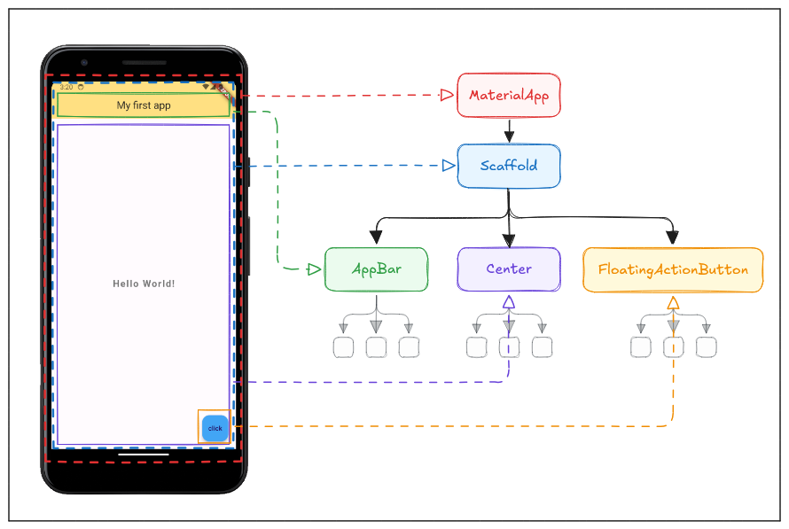

</div>

Widget are able to be nested within each other to create complex user interfaces. For example, a `Scaffold` widget can contain an `AppBar`, a `Center` as a body, a `FloatingActionButton`, and more.

### Widget state

Widgets can be stateless or stateful. Stateless widgets are immutable, meaning that their properties can't change - all values are final (used for static content). Stateful widgets maintain state that might change during the lifetime of the widget (used for dynamic content).

For this module, we will focus on stateless widgets that provided by Flutter.

## Images

Images can be displayed in Flutter using the `Image` widget. The `Image` widget can display images from the network or from the local assets.

### Network Image

To display an image from the network, use the `NetworkImage` widget in the `Image` widget. Try changing the `body` of `Scaffold` to display an image from the network.

```dart
body: Center(
  child: Image(
    image: NetworkImage('https://picsum.photos/200'),
  ),
),
```

or

```dart
body: Center(
  child: Image.network('https://picsum.photos/200'),
),
```

<div align="center">

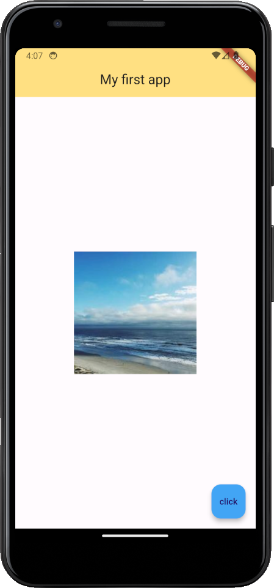

</div>

### Asset Image

To display an image from asset directory, we need to create the `assets` directory in the root of the project and add the image file. Then, we need to modify the `pubspec.yaml` file to include the asset (below the commented instruction).

<div align="center">

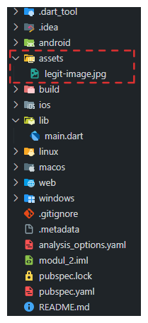

</div>

```yaml
# To add assets to your application, add an assets section, like this:
# assets:
#   - images/a_dot_burr.jpeg
#   - images/a_dot_ham.jpeg

assets:
  - assets/ # add this line to include the assets directory
  - assets/legit-image.jpg # add this line to include specific image file
```

Then, we can display the image from the asset directory by using the `AssetImage` widget in the `Image` widget.

```dart
body: Center(
  child: Image(
    image: AssetImage('assets/legit-image.jpg'),
  ),
),
```

or

```dart
body: Center(
  child: Image.asset('assets/legit-image.jpg'),
),
```

<div align="center">

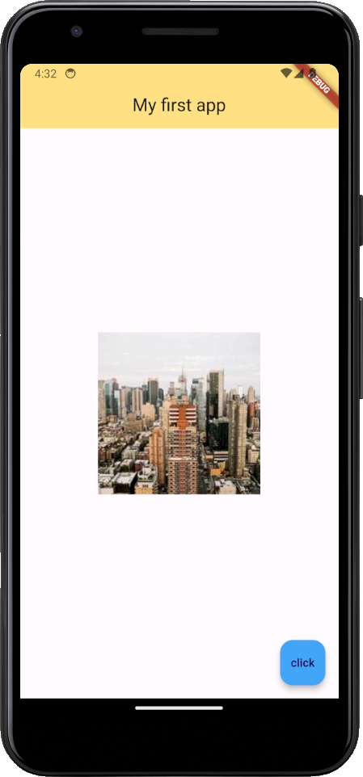

</div>

Want to know more about asset image? [See the docs](https://docs.flutter.dev/ui/assets/assets-and-images)

## Buttons & Icons

Buttons and icons are essential widgets in Flutter for user interaction. Flutter provides various types of buttons and icons that can be customized to suit the app's design.

### Icons

Icons are visual symbols for representing actions, objects, or concepts. Flutter provides a wide range of icons that can be used in the app. To use an icon, we can use the `Icon` widget. Try changing the `body` of `Scaffold` to display an icon.

```dart
body: Center(
  child: Icon(
    Icons.ac_unit,
    color: Colors.lightBlue,
    size: 50.0,
  ),
),
```

<div align="center">

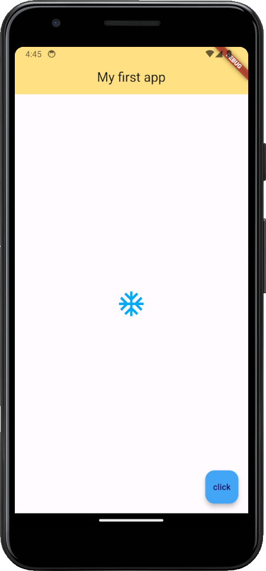

</div>

Tips: you can click `Ctrl` + `Space` to see the available icons or the attribute.

<div align="center">

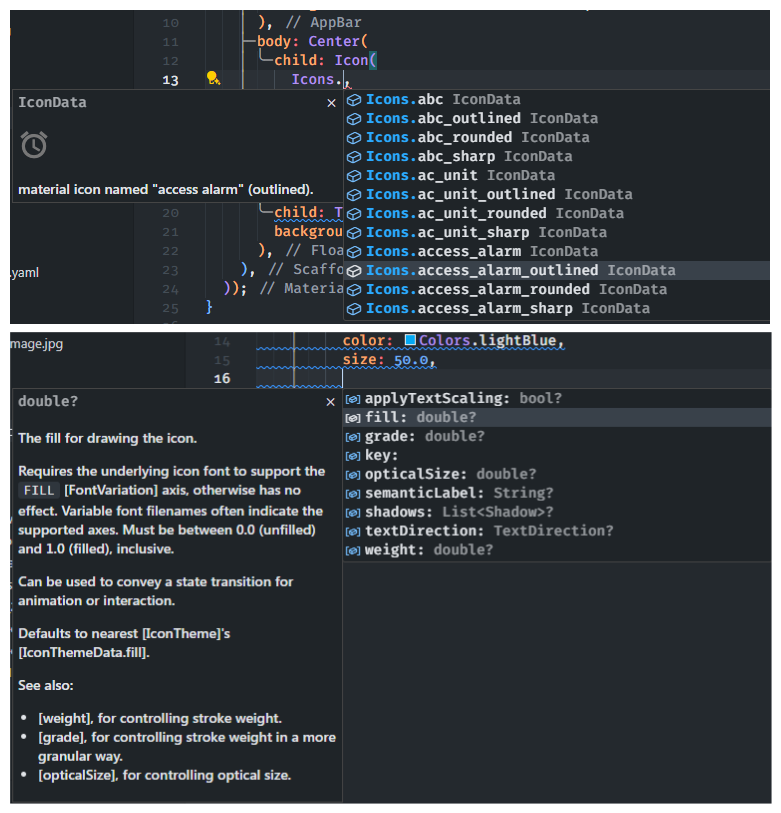

</div>

### Buttons

Buttons are used to trigger an action when clicked. Flutter provides various types of buttons, such as `ElevatedButton`, `TextButton`, and `OutlinedButton`. To use a button, we can use the `ElevatedButton` widget. Try changing the `floatingActionButton` of `Scaffold` to display a button.

```dart
floatingActionButton: ElevatedButton(
  onPressed: () {},
  child: Text('click'),
),
```

Try using the `TextButton` and `OutlinedButton` widgets to see the different button styles.

<div align="center">

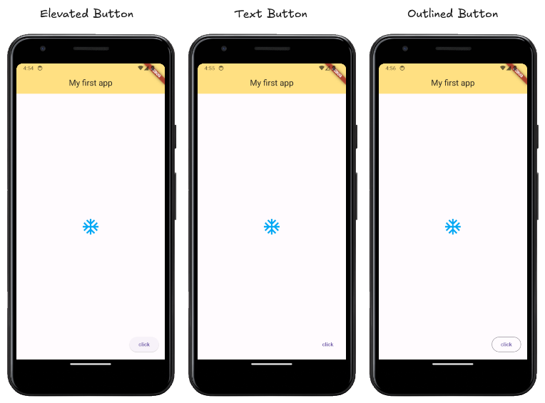

</div>

Buttons can be styled using the `style` property of the button widget. The `style` property can be used to set the button's text style, background color, and more.

```dart
floatingActionButton: ElevatedButton(
  onPressed: () {},
  child: Icon(Icons.add),
  style: ElevatedButton.styleFrom(
    backgroundColor: Colors.lightBlue,
    shape: CircleBorder(),
    padding: EdgeInsets.all(20.0),
  ),
),
```

<div align="center">

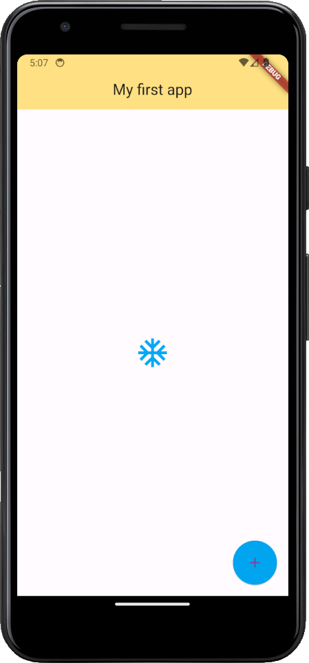

</div>

## Containers & Padding

Containers are used to create a visual element in the app. Containers can be adjusted in terms of size, padding, margin, and more. Here is the illustration of the container with padding and margin.

<div align="center">

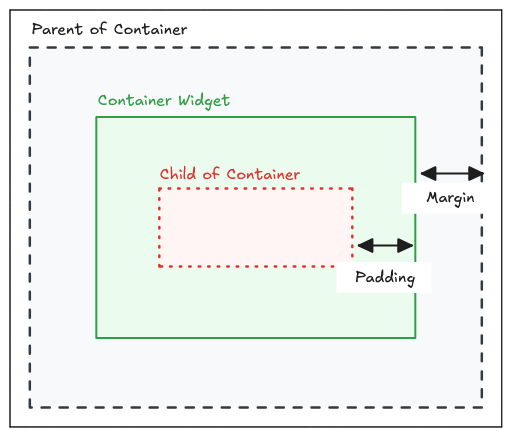

</div>

To create a container with padding and margin, we can use the `Container` widget with the `padding` and `margin` property.

```dart
body: Container(
  padding: EdgeInsets.all(20.0),
  margin: EdgeInsets.all(20.0),
  color: Colors.amber,
  child: Text('This is container'),
),
```

<div align="center">

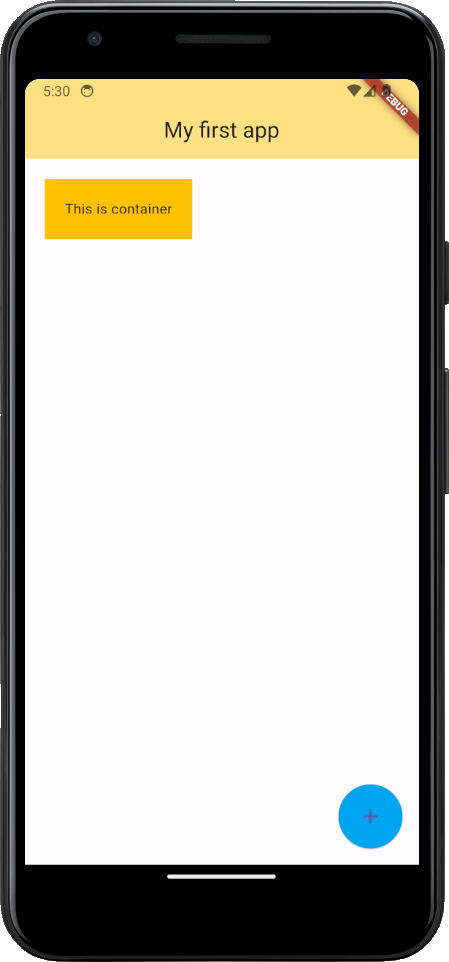

</div>

Padding and margin property are using `EdgeInsets` class to set the padding and margin. The `EdgeInsets` class provides various methods to set the padding and margin, such as `all`, `only`, `symmetric`, and more.

```dart
padding: EdgeInsets.all(20.0), // all sides
padding: EdgeInsets.only(left: 20.0), // only left side
padding: EdgeInsets.symmetric(horizontal: 20.0), // horizontal sides
padding: EdgeInsets.fromLTRB(10.0, 20.0, 30.0, 40.0), // left, top, right, bottom
```

If we want to only add padding to the child widget, we can use the `Padding` widget instead of the `padding` property of the `Container` widget.

```dart
body: Padding(
  padding: EdgeInsets.all(40.0),
  child: Text('Hello World!'),
),
```

<div align="center">

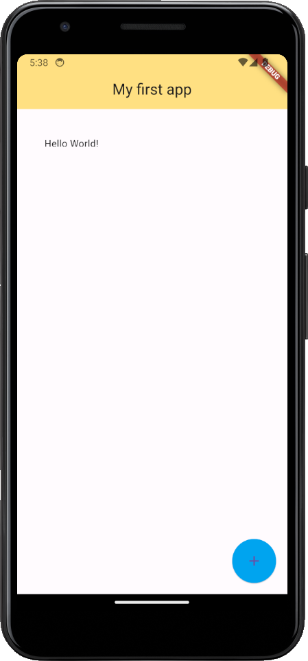

</div>

## Rows & Columns

Rows and columns are used to arrange child widgets horizontally (row) or vertically (column). Rows and columns can be used to create complex layouts in the app.

For easier demonstration, we will be using containers as child widgets for rows and columns.

To create a row, we can use the `Row` widget with the `children` property.

```dart
body: Container(
  decoration: BoxDecoration(
    border: Border.all(color: Colors.black),
  ),
  child: Row(
    mainAxisAlignment: MainAxisAlignment.center,
    crossAxisAlignment: CrossAxisAlignment.center,
    children: [
      Container(
        decoration: BoxDecoration(
          border: Border.all(color: Colors.black),
        ),
        width: 100,
        height: 100,
        child: Text('Container 1'),
      ),
      Container(
        decoration: BoxDecoration(
          border: Border.all(color: Colors.black),
        ),
        width: 150,
        height: 150,
        child: Text('Container 2'),
      ),
    ],
  ),
),
```

<div align="center">

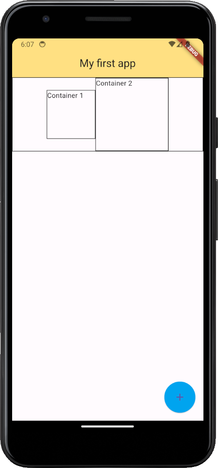

</div>

To create a column, we can use the `Column` widget with the `children` property.

```dart
body: Container(
  decoration: BoxDecoration(
    border: Border.all(color: Colors.black),
  ),
  child: Column(
    mainAxisAlignment: MainAxisAlignment.center,
    crossAxisAlignment: CrossAxisAlignment.center,
    children: [
      Container(
        decoration: BoxDecoration(
          border: Border.all(color: Colors.black),
        ),
        width: 100,
        height: 100,
        child: Text('Container 1'),
      ),
      Container(
        decoration: BoxDecoration(
          border: Border.all(color: Colors.black),
        ),
        width: 150,
        height: 150,
        child: Text('Container 2'),
      ),
    ],
  ),
),
```

<div align="center">

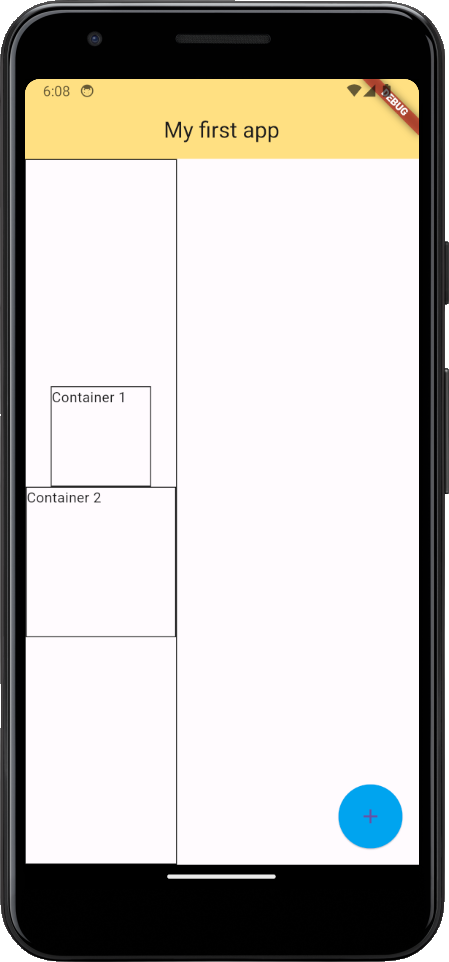

</div>

Attributes like `mainAxisAlignment` and `crossAxisAlignment` can be used to align the child widgets in the row or column. The `mainAxisAlignment` attribute is used to align the child widgets along the main axis (row for row, column for column), while the `crossAxisAlignment` attribute is used to align the child widgets along the cross axis (column for row, row for column).

Try changing the `mainAxisAlignment` and `crossAxisAlignment` attributes to see the different alignments.

Want to know more about rows and columns? [See the docs](https://docs.flutter.dev/ui/layout)

## Challenge

Can you recreate this layout using the widgets we have learned so far?

<div align="center">

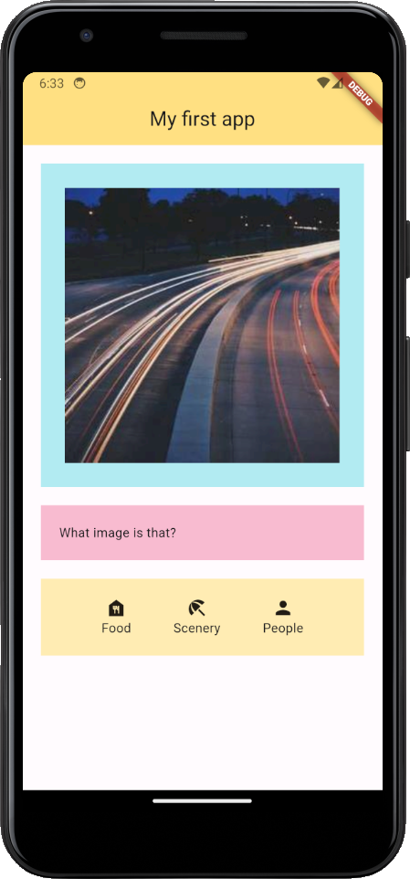

</div>
