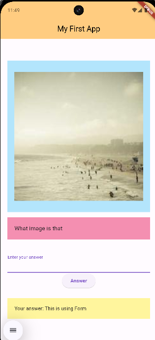

# 05. Form

[Previous](/04.%20Stateful%20and%20Starting%20the%20World%20Time%20App/) | [Main Page](/) | [Next](/06.%20Firebase/)

## Content Outline

- [Form](#form)
  - [TextField](#textfield)
  - [TextEditingController](#Texteditingcontroller)
  - [Form Widget](#form-widget)
  - [TextFormField](#textformfield)
  - [Another Example Project](#another-example-project)

## Form

Form is used for collecting user input. There are two ways to make a form in Flutter by using `TextEditingController` or using `Form` Widget.

### TextField

`TextField` is a Material Design widget to accept user input in the form of text by using hardware keyboard or with an onscreen keyboard. The `onChanged` callback is called whenever the user changes the text in the field. If the user indicates that they are done typing in the field, the `TextField` calls the `onSubmitted` callback.

`TextField` has a `decoration` property to give the text field a label or an icon. To control the text that is displayed in the text field, we need to use a `controller`.

```dart
TextField(
  controller: _controller,
  decoration: InputDecoration(label: Text("Here is your label")),
),
```

### TextEditingController

`TextEditingController` is a controller used for an editable text field. When the text field updates value from the user, the controller norifies its listeners and take the text from the text field.

```dart
TextEditingController _controller = TextEditingController()
```

Here is the example to create form using `TextField` and `TextEditingController`.

```dart
class _FormImageState extends State<FormImage> {
  String answer = '';
  TextEditingController _controller = TextEditingController();
  @override
  Widget build(BuildContext context) {
    return Container(
      child: Column(
        children: [
          Padding(
            padding: const EdgeInsets.all(20.0),
            child: Column(
              children: [
                TextField(
                  controller: _controller,
                  decoration: InputDecoration(label: Text("Enter your answer")),
                ),
                ElevatedButton(onPressed: () {
                  setState(() {
                    answer = _controller.text;
                  });

                }, child: Text("Answer"))
              ],
            ),
          ),
          Container(
              width: MediaQuery.of(context).size.width,
              margin: EdgeInsets.fromLTRB(20.0, 5.0, 20.0, 10.0),
              padding: EdgeInsets.all(20.0),
              color: Colors.yellow[200],
              child: Text("Your answer: $answer"))

        ],
      )
    );
  }
}
```

Explanation:

- We have one `TextField` to put our answer and we assigned it into `_controller` as `TextEditingController`
- When we clicked the `ElevatedButton`, the text value from `TextField` by using its controller will be assigned into variable `answer`.

**Full code**

```dart
import 'package:flutter/material.dart';

void main() {
  runApp(const MyApp());
}

class MyApp extends StatelessWidget {
  const MyApp({super.key});

  // This widget is the root of your application.
  @override
  Widget build(BuildContext context) {
    return MaterialApp(
      title: 'Flutter Demo',
      theme: ThemeData(
        colorScheme: ColorScheme.fromSeed(seedColor: Colors.deepPurple),
        useMaterial3: true,
      ),
      home: const RowColumnPage(),
    );
  }
}

class RowColumnPage extends StatelessWidget {
  const RowColumnPage({Key? key}) : super(key: key);


  @override
  Widget build(BuildContext context) {
    MediaQueryData mediaQueryData = MediaQuery.of(context);
    double screenWidth = mediaQueryData.size.width;
    double screenHeight = mediaQueryData.size.height;
    return Scaffold(
      appBar: AppBar(
        title: const Text(
          'My First App',
          style: TextStyle(color: Colors.black),
        ),
        backgroundColor: Colors.orange[200],
        centerTitle: true,
      ),
      body: Column(
        crossAxisAlignment: CrossAxisAlignment.center,
        mainAxisAlignment: MainAxisAlignment.center,
        children: <Widget>[
          Container(
            child: AspectRatio(
              aspectRatio: 1.0,
              child: Container(
                width: MediaQuery.of(context).size.width,
                margin: EdgeInsets.fromLTRB(20.0, 5.0, 20.0, 10.0),
                padding: EdgeInsets.all(20.0),
                color: Colors.lightBlue[100],
                child: Center(
                  child: Image.network(
                    'https://picsum.photos/200',
                    fit: BoxFit.cover,
                    width: 500,
                  ),
                ),
              ),
            ),
          ),
          Container(
            width: MediaQuery.of(context).size.width,
            margin: EdgeInsets.fromLTRB(20.0, 5.0, 20.0, 10.0),
            padding: EdgeInsets.all(20.0),
            color: Colors.pink[200],
            child: Text('What image is that', style: TextStyle(fontSize: 16)),
          ),
          FormImage(),
          // CounterCard(),
        ]
      ),
    );
  }
}

class FormImage extends StatefulWidget {
  const FormImage({super.key});

  @override
  State<FormImage> createState() => _FormImageState();
}

class _FormImageState extends State<FormImage> {
  String answer = '';
  TextEditingController _controller = TextEditingController();
  @override
  Widget build(BuildContext context) {
    return Container(
      child: Column(
        children: [
          Padding(
            padding: const EdgeInsets.all(20.0),
            child: Column(
              children: [
                TextField(
                  controller: _controller,
                  decoration: InputDecoration(label: Text("Enter your answer")),
                ),
                ElevatedButton(onPressed: () {
                  setState(() {
                    answer = _controller.text;
                  });

                }, child: Text("Answer"))
              ],
            ),
          ),
          Container(
              width: MediaQuery.of(context).size.width,
              margin: EdgeInsets.fromLTRB(20.0, 5.0, 20.0, 10.0),
              padding: EdgeInsets.all(20.0),
              color: Colors.yellow[200],
              child: Text("Your answer: $answer"))

        ],
      )
    );
  }
}

```


## Form Widget

Flutter provides Form widget as an optional container for grouping together multiple form field widgets. It allows to add validation on text fields. There are some properties of Form widget.

1. **key**: A GlobalKey that uniquely identifies the Form. We can use this key to interact with the form, such as validating, resetting, or saving its state.
2. **child**: The child widget that contains the form fields
3. **autoValidateMode**: An enum that specifies when the form should automatically validate its fields.

There are also some methods of Form Widget.

1. **validate()**: This method is used to trigger the validation of all the form fields within the Form. It returns true if all fields are valid, otherwise false. You can use it to check the overall validity of the form before submitting it.
2. **save()**: This method is used to save the current values of all form fields. It invokes the onSaved callback for each field. Typically, this method is called after validation succeeds.
3. **reset()**: Resets the form to its initial state, clearing any user-entered data.
   currentState: A getter that returns the current FormState associated with the Form.

## TextFormField

`TextFormField` is a FormField that contains a `TextField`. It builds on `TextField` by integrating validation, input handling, and form state management. It is commonly used inside a `Form` widget to handle user input efficiently.

`TextFormField` has some methods including:

1. `onSaved`: This method is used whenever user saves the form.
2. `validator`: This method is used to validate the text value entered by the user.

Here is the example of validator method:

```dart
TextFormField(
  decoration: InputDecoration(label: Text("Here is your label")),
  // The validator receives the text that the user has entered.
  validator: (value) {
    if (value == null || value.isEmpty) {
      return 'Please enter some text';
    }
    return null;
  },
  onSaved: (value) => {},
),
```

Explanation:

- Validator checks whether the value is empty or not.

Let's replace `TextEditingController` and `TextField` widgets with `Form` and `TextFormField` widgets from the app before.

```dart
class _FormImageState extends State<FormImage> {
  final _formKey = GlobalKey<FormState>();
  String _answer = '';
  @override
  Widget build(BuildContext context) {
    return Container(
        child: Column(
          children: [
            Padding(
              padding: const EdgeInsets.all(20.0),
              child: Form(
                key: _formKey,
                child: Column(
                  children: [
                    TextFormField(
                      decoration: InputDecoration(label: Text("Enter your answer")),
                      validator: (value) => value!.isEmpty ? 'Please answer' : null,
                      onSaved: (value) => setState(() {
                        _answer = value!;
                      }),
                    ),
                    ElevatedButton(onPressed: () {
                      if (_formKey.currentState!.validate()) {
                        _formKey.currentState!.save();
                        _formKey.currentState!.reset();
                      }

                    }, child: Text("Answer"))
                  ],
                ),
              ),
            ),
            Container(
                width: MediaQuery.of(context).size.width,
                margin: EdgeInsets.fromLTRB(20.0, 5.0, 20.0, 10.0),
                padding: EdgeInsets.all(20.0),
                color: Colors.yellow[200],
                child: Text("Your answer: $_answer"))

          ],
        )
    );
  }
}
```

Explanation:

- `_formKey` is used as an identifier for our form. It can be used to check to validate, save, and reset at the save button
- `TextFormField` can automatically save the answer value to its variable by using `onSaved` method.

**Full code**

```dart
import 'package:flutter/material.dart';

void main() {
  runApp(const MyApp());
}

class MyApp extends StatelessWidget {
  const MyApp({super.key});

  // This widget is the root of your application.
  @override
  Widget build(BuildContext context) {
    return MaterialApp(
      title: 'Flutter Demo',
      theme: ThemeData(
        colorScheme: ColorScheme.fromSeed(seedColor: Colors.deepPurple),
        useMaterial3: true,
      ),
      home: const RowColumnPage(),
    );
  }
}

class RowColumnPage extends StatelessWidget {
  const RowColumnPage({Key? key}) : super(key: key);


  @override
  Widget build(BuildContext context) {
    MediaQueryData mediaQueryData = MediaQuery.of(context);
    double screenWidth = mediaQueryData.size.width;
    double screenHeight = mediaQueryData.size.height;
    return Scaffold(
      appBar: AppBar(
        title: const Text(
          'My First App',
          style: TextStyle(color: Colors.black),
        ),
        backgroundColor: Colors.orange[200],
        centerTitle: true,
      ),
      body: Column(
          crossAxisAlignment: CrossAxisAlignment.center,
          mainAxisAlignment: MainAxisAlignment.center,
          children: <Widget>[
            Container(
              child: AspectRatio(
                aspectRatio: 1.0,
                child: Container(
                  width: MediaQuery.of(context).size.width,
                  margin: EdgeInsets.fromLTRB(20.0, 5.0, 20.0, 10.0),
                  padding: EdgeInsets.all(20.0),
                  color: Colors.lightBlue[100],
                  child: Center(
                    child: Image.network(
                      'https://picsum.photos/200',
                      fit: BoxFit.cover,
                      width: 500,
                    ),
                  ),
                ),
              ),
            ),
            Container(
              width: MediaQuery.of(context).size.width,
              margin: EdgeInsets.fromLTRB(20.0, 5.0, 20.0, 10.0),
              padding: EdgeInsets.all(20.0),
              color: Colors.pink[200],
              child: Text('What image is that', style: TextStyle(fontSize: 16)),
            ),
            FormImage(),
            // CounterCard(),
          ]
      ),
    );
  }
}

class FormImage extends StatefulWidget {
  const FormImage({super.key});

  @override
  State<FormImage> createState() => _FormImageState();
}

class _FormImageState extends State<FormImage> {
  final _formKey = GlobalKey<FormState>();
  String _answer = '';
  @override
  Widget build(BuildContext context) {
    return Container(
        child: Column(
          children: [
            Padding(
              padding: const EdgeInsets.all(20.0),
              child: Form(
                key: _formKey,
                child: Column(
                  children: [
                    TextFormField(
                      decoration: InputDecoration(label: Text("Enter your answer")),
                      validator: (value) => value!.isEmpty ? 'Please answer' : null,
                      onSaved: (value) => setState(() {
                        _answer = value!;
                      }),
                    ),
                    ElevatedButton(onPressed: () {
                      if (_formKey.currentState!.validate()) {
                        _formKey.currentState!.save();
                        _formKey.currentState!.reset();
                      }

                    }, child: Text("Answer"))
                  ],
                ),
              ),
            ),
            Container(
                width: MediaQuery.of(context).size.width,
                margin: EdgeInsets.fromLTRB(20.0, 5.0, 20.0, 10.0),
                padding: EdgeInsets.all(20.0),
                color: Colors.yellow[200],
                child: Text("Your answer: $_answer"))

          ],
        )
    );
  }
}
```



## Another Example Project

Here are some examples of projects for using forms.

- <https://github.com/weynard02/ppb_week5>
- <https://github.com/hilmizr/ets_cinema_app>
