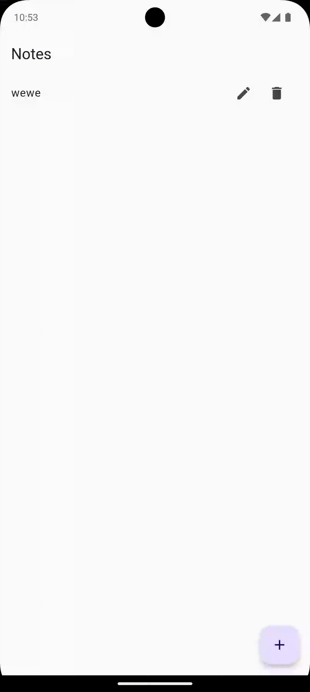

# 06. CRUD Local Database

[Previous](/05.%20Form/) | [Main Page](/) | [Next](/07.%20Relational%20Table/)

## Content Outline

- [Setup](#setup)
- [Note](#note)
- [Note Database](#note-database)
  - [Initialization](#initialization)
  - [Create](#create)
  - [Read](#read)
  - [Update](#update)
  - [Delete](#delete)
- [CRUD Page](#crud-page)

## Setup

In this module, we will try to create a Note CRUD application using local database storage. First, we will prepare the main pages: `main.dart` and `notes_page.dart`.

```dart
// main.dart
import 'package:flutter/material.dart';

void main() async {

  runApp(const MyApp());
}

class MyApp extends StatelessWidget {
  const MyApp({super.key});

  // This widget is the root of your application.
  @override
  Widget build(BuildContext context) {
    return const MaterialApp(
      debugShowCheckedModeBanner: false,
      home: NotesPage()
    );
  }
}

```

```dart
// pages/notes_page.dart
import 'package:flutter/material.dart';

class NotesPage extends StatefulWidget {
  const NotesPage({super.key});

  @override
  State<NotesPage> createState() => _NotesPageState();
}

class _NotesPageState extends State<NotesPage> {


  @override
  Widget build(BuildContext context) {

    return Scaffold(
        appBar: AppBar(title: const Text('Notes')),
        floatingActionButton: FloatingActionButton(
          onPressed: createNote,
          child: const Icon(Icons.add),
        ),);
  }
}
```

Next, we will prepare which local database to use. This time, we will try using Isar. You can adjust it with another local database. First, we add the dependencies as follows:

```sh
flutter pub add isar isar_flutter_libs path_provider
flutter pub add -d isar_generator build_runner
flutter pub add provider
```

## Note

Once the dependencies are ready, we will create the `Note` class using Isar.

```dart
// models/note.dart
import 'package:isar/isar.dart';

// this line is needed to generate file
// then run dart run build_runner build
part 'note.g.dart';

@Collection()
class Note {
  Id id = Isar.autoIncrement;
  late String text;
}
```

In `Note`, there are only two properties: `id` and `text` as the collection. We need to include `part 'note.g.dart';` so that this file can be modified to run in Flutter. Once Note is ready, please run `dart run build_runner build` in the terminal.

## Note Database

Next, we will create the database. Prepare `note_database.dart`.

```dart
// models/note_database.dart
import 'package:crud_local_database_app/models/note.dart';
import 'package:flutter/cupertino.dart';
import 'package:isar/isar.dart';
import 'package:path_provider/path_provider.dart';
import 'dart:io';

class NoteDatabase extends ChangeNotifier{
  static late Isar isar;

  // INIT

  // list
  final List<Note> currentNotes = [];

  // create

  // read

  // update

  // delete

}
```

We will implement each part for initializing the database, and the create, read, update, and delete features.

### Initialization

Initialization is needed so that the Isar database can be registered in the device directory location. Please add this code in the INIT section.

```dart
    // INIT
  static Future<void> initialize() async {
    if (Platform.isAndroid) { // Check if it's Android
      final dir = await getApplicationDocumentsDirectory();
      isar = await Isar.open([NoteSchema], directory: dir.path);
    } else {
      // Handle other platforms or provide a default directory
      final dir = getTemporaryDirectory(); // Example for other platforms
      isar = await Isar.open([NoteSchema], directory: (await dir).path);
    }
  }

```

### Create

Create is a method to add or create a new object (in this case: Note).

```dart
  // create
  Future<void> addNote(String textFromUser) async {
    // create a new object
    final newNote = Note()..text = textFromUser;

    // save to db
    await isar.writeTxn(() => isar.notes.put(newNote));

    // re-read from db
    fetchNotes();
  }
```

This function will process `textFromUser` into the `text` property of `Note`. `isar.writeTxn` is a function to run a write transaction to store `newNote` into Isar’s `notes`.

### Read

`fetchNotes` is a function to retrieve note data from Isar into the `currentNotes` variable, which will be used in the app interface. Here is the code.

```dart
  // read
  Future<void> fetchNotes() async {
    List<Note> fetchedNotes = await isar.notes.where().findAll();
    currentNotes.clear();
    currentNotes.addAll(fetchedNotes);
    notifyListeners();
  }
```

This function will get all notes into the `fetchedNotes` variable and then store them in `currentNotes`, and signal that `currentNotes` has been updated.

### Update

Next is the function to update a note. Here is the code:

```dart
  // update
  Future<void> updateNote(int id, String newText) async {
    final existingNote = await isar.notes.get(id);
    if (existingNote != null) {
      existingNote.text = newText;
      await isar.writeTxn(() => isar.notes.put(existingNote));
      await fetchNotes();
    }
  }
```

This function will retrieve a `Note` by its `id`. If available, it will update the note using `writeTxn`. Don’t forget to also update `currentNotes` using the `fetchNotes` function.

### Delete

This function is to delete a note based on its id. Don’t forget to also update `currentNotes` using the `fetchNotes` function.

```dart
  // delete
  Future<void> deleteNote(int id) async {
    await isar.writeTxn(() => isar.notes.delete(id));
    await fetchNotes();
  }
```

Complete code as follows:

```dart
import 'package:crud_local_database_app/models/note.dart';
import 'package:flutter/cupertino.dart';
import 'package:isar/isar.dart';
import 'package:path_provider/path_provider.dart';
import 'dart:io';

class NoteDatabase extends ChangeNotifier{
  static late Isar isar;

  // INIT
  static Future<void> initialize() async {
    if (Platform.isAndroid) { // Check if it's Android
      final dir = await getApplicationDocumentsDirectory();
      isar = await Isar.open([NoteSchema], directory: dir.path);
    } else {
      // Handle other platforms or provide a default directory
      final dir = getTemporaryDirectory(); // Example for other platforms
      isar = await Isar.open([NoteSchema], directory: (await dir).path);
    }
  }

  // list
  final List<Note> currentNotes = [];

  // create
  Future<void> addNote(String textFromUser) async {
    // create a new object
    final newNote = Note()..text = textFromUser;

    // save to db
    await isar.writeTxn(() => isar.notes.put(newNote));

    // re-read from db
    fetchNotes();
  }
  // read
  Future<void> fetchNotes() async {
    List<Note> fetchedNotes = await isar.notes.where().findAll();
    currentNotes.clear();
    currentNotes.addAll(fetchedNotes);
    notifyListeners();
  }
  // update
  Future<void> updateNote(int id, String newText) async {
    final existingNote = await isar.notes.get(id);
    if (existingNote != null) {
      existingNote.text = newText;
      await isar.writeTxn(() => isar.notes.put(existingNote));
      await fetchNotes();
    }
  }
  // delete
  Future<void> deleteNote(int id) async {
    await isar.writeTxn(() => isar.notes.delete(id));
    await fetchNotes();
  }
}
```

## CRUD Page

Next, how do we call the database functions in the pages? This can be done using the following commands:

```dart
context.read<NoteDatabase>() // returns but no listening
context.watch<NoteDatabase>() // returns and listening
```

These functions can directly call functions from the `NoteDatabase` class.

We also need to prepare `final textController = TextEditingController();` to store the user’s text input.

Let’s first create the page structure:

```dart
@override
  Widget build(BuildContext context) {
    // note database
    final noteDatabase = context.watch<NoteDatabase>();

    // current notes
    List<Note> currentNotes = noteDatabase.currentNotes;

    return Scaffold(
        appBar: AppBar(title: const Text('Notes')),
        floatingActionButton: FloatingActionButton(
          onPressed: createNote,
          child: const Icon(Icons.add),
        ),
        body: ListView.builder(
          itemCount: currentNotes.length,
          itemBuilder: (context, index) {
            // get individual note
            final note = currentNotes[index];

            // list tile UI
            return ListTile(
              title: Text(note.text),
              trailing: Row(
                mainAxisSize: MainAxisSize.min,
                children: [
                  // edit button
                  IconButton(
                      onPressed: () => updateNote(note),
                      icon: const Icon(Icons.edit)),
                  // delete button
                  IconButton(
                      onPressed: () => deleteNote(note.id),
                      icon: const Icon(Icons.delete))
                ],
              ),
            );
          },
        ));
  }
```

We need `currentNotes` to get the existing notes from the database. Next, we will complete the `createNote`, `updateNote`, `deleteNote`, and `readNote` functions.

The `createNote` function will create a form and add a note to `NoteDatabase` using the `addNote` function.

```dart
// create a note
  void createNote() {
    showDialog(
      context: context,
      builder: (context) => AlertDialog(
        content: TextField(
          controller: textController,
        ),
        actions: [
          MaterialButton(
            onPressed: () {
              // add to db
              context.read<NoteDatabase>().addNote(textController.text);

              // clear controller
              textController.clear();

              Navigator.pop(context);
            },
            child: const Text("Create"),
          )
        ],
      ),
    );
  }
```

The `updateNote` function will take the `Note` to be edited by showing a form and then updating it using the `update` function.

```dart
 // update a note
  void updateNote(Note note) {
    textController.text = note.text;
    showDialog(
        context: context,
        builder: (context) => AlertDialog(
          title: Text("Update Note"),
          content: TextField(controller: textController),
          actions: [
            MaterialButton(
                onPressed: () {
                  context
                      .read<NoteDatabase>()
                      .updateNote(note.id, textController.text);
                  // clear controller
                  textController.clear();

                  Navigator.pop(context);
                },
                child: const Text("Update"))
          ],
        ));
  }
```

The `deleteNote` function will directly delete the selected note from the database using the `deleteNote` method.

```dart
  void deleteNote(int id) {
    context.read<NoteDatabase>().deleteNote(id);
  }
```

Lastly, there's the `readNotes` function which is used to retrieve data from the database into `currentNotes`.

```dart
  void readNotes() {
    context.read<NoteDatabase>().fetchNotes(); // Use read instead of watch
  }

```

This function will be called at the start of the program execution. You can use `initState()` as follows:

```dart
  @override
  void initState() {
    super.initState();
    readNotes();
  }

```

The complete code as below:

```dart
// pages/notes_page.dart

import 'package:crud_local_database_app/models/note.dart';
import 'package:crud_local_database_app/models/note_database.dart';
import 'package:flutter/material.dart';
import 'package:provider/provider.dart';

class NotesPage extends StatefulWidget {
  const NotesPage({super.key});

  @override
  State<NotesPage> createState() => _NotesPageState();
}

class _NotesPageState extends State<NotesPage> {
  // text controller to access what the user typed
  final textController = TextEditingController();

  @override
  void initState() {
    super.initState();
    readNotes();
  }

  // create a note
  void createNote() {
    showDialog(
      context: context,
      builder: (context) => AlertDialog(
        content: TextField(
          controller: textController,
        ),
        actions: [
          MaterialButton(
            onPressed: () {
              // add to db
              context.read<NoteDatabase>().addNote(textController.text);

              // clear controller
              textController.clear();

              Navigator.pop(context);
            },
            child: const Text("Create"),
          )
        ],
      ),
    );
  }

  // read notes
  void readNotes() {
    context.read<NoteDatabase>().fetchNotes(); // Use read instead of watch
  }

  // update a note
  void updateNote(Note note) {
    textController.text = note.text;
    showDialog(
        context: context,
        builder: (context) => AlertDialog(
          title: Text("Update Note"),
          content: TextField(controller: textController),
          actions: [
            MaterialButton(
                onPressed: () {
                  context
                      .read<NoteDatabase>()
                      .updateNote(note.id, textController.text);
                  // clear controller
                  textController.clear();

                  Navigator.pop(context);
                },
                child: const Text("Update"))
          ],
        ));
  }

  // delete a note
  void deleteNote(int id) {
    context.read<NoteDatabase>().deleteNote(id);
  }

  @override
  Widget build(BuildContext context) {
    // note database
    final noteDatabase = context.watch<NoteDatabase>();

    // current notes
    List<Note> currentNotes = noteDatabase.currentNotes;

    return Scaffold(
        appBar: AppBar(title: const Text('Notes')),
        floatingActionButton: FloatingActionButton(
          onPressed: createNote,
          child: const Icon(Icons.add),
        ),
        body: ListView.builder(
          itemCount: currentNotes.length,
          itemBuilder: (context, index) {
            // get individual note
            final note = currentNotes[index];

            // list tile UI
            return ListTile(
              title: Text(note.text),
              trailing: Row(
                mainAxisSize: MainAxisSize.min,
                children: [
                  // edit button
                  IconButton(
                      onPressed: () => updateNote(note),
                      icon: const Icon(Icons.edit)),
                  // delete button
                  IconButton(
                      onPressed: () => deleteNote(note.id),
                      icon: const Icon(Icons.delete))
                ],
              ),
            );
          },
        ));
  }
}
```

In the `main` function, we need to initialize the Isar database at the beginning as follows:

```dart
import 'package:crud_local_database_app/models/note_database.dart';
import 'package:crud_local_database_app/pages/notes_page.dart';
import 'package:provider/provider.dart';
import 'package:flutter/material.dart';


void main() async {
  WidgetsFlutterBinding.ensureInitialized();
  await NoteDatabase.initialize();

  runApp(
    ChangeNotifierProvider(
      create: (context) => NoteDatabase(),
      child: const MyApp(),
    )
  );
}

class MyApp extends StatelessWidget {
  const MyApp({super.key});

  // This widget is the root of your application.
  @override
  Widget build(BuildContext context) {
    return const MaterialApp(
      debugShowCheckedModeBanner: false,
      home: NotesPage()
    );
  }
}

```

### Result:



If there is an error while running the app, try to replace `subproject` on `android/build.gradle`.

```kts
subprojects {
    afterEvaluate { project ->
        if (project.plugins.hasPlugin("com.android.application") ||
                project.plugins.hasPlugin("com.android.library")) {
            project.android {
                compileSdkVersion 34
                buildToolsVersion "34.0.0"
            }
        }
        if (project.hasProperty("android")) {
            project.android {
                if (namespace == null) {
                    namespace project.group
                }
            }
        }
    }
    project.buildDir = "${rootProject.buildDir}/${project.name}"
    project.evaluationDependsOn(':app')
}
```

You can learn with other databases like Hive and ObjectBox with these references:

- web article: https://blog.logrocket.com/comparing-hive-other-flutter-app-database-options & https://github.com/o-ifeanyi/db_benchmarks
- Flutter Hive Database Tutorial: https://www.youtube.com/watch?v=FB9GpmL0Qe0
- Flutter ObjectBox Database Tutorial: English version
- Flutter SQFlite Database Tutorial: https://www.youtube.com/watch?v=bihC6ou8FqQ
- Flutter Isar Database Tutorial : https://www.youtube.com/watch?v=jVgQ5esp-PE
