# 08. Firebase Auth

[Previous](/07.%20Awesome%20Notifications/) | [Main Page](/) | [Next](/09.%20Connecting%20API%20-%20Machine%20Learning%20Service/)

## Content Outline

## Local Setup

To use Firebase service, you need to log in to your Firebase account in your terminal using Firebase CLI. Firebase CLI can be installed using the following command:

```bash
npm install -g firebase-tools
```

or you can download it from the [Firebase CLI documentation](https://firebase.google.com/docs/cli).

After that, log in to your Firebase account using the following command:

```bash
firebase login
```

## Create a Firebase Project

Before you can use Firebase Authentication, you need to create a Firebase project. To do this, follow these steps:

1. Go to the [Firebase Console](https://console.firebase.google.com/).
2. Click on "Add project" and follow the prompts to create a new project.

   <div align="center">
      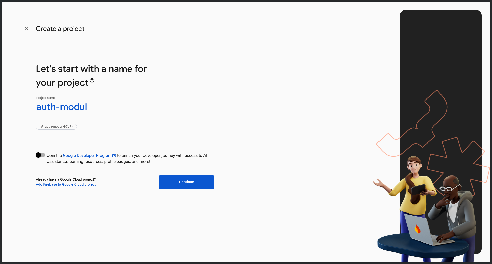
      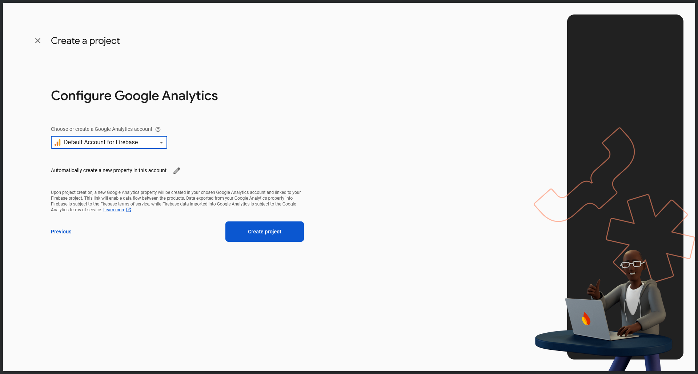
   </div>

3. Once your project is created, add Flutter as a platform.

   <div align="center">
      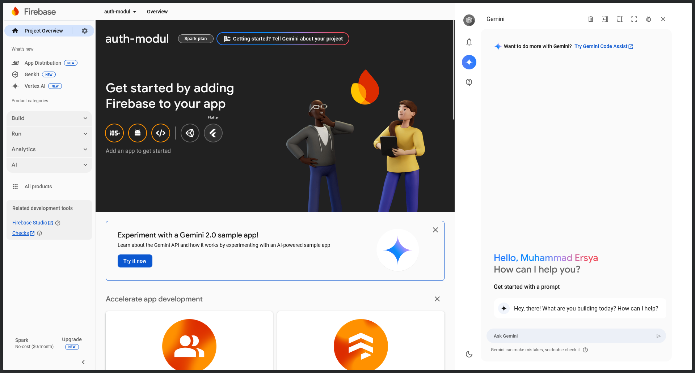
      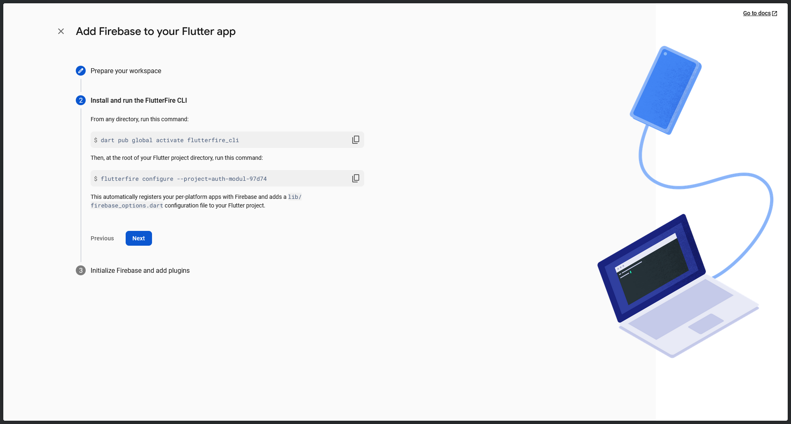
      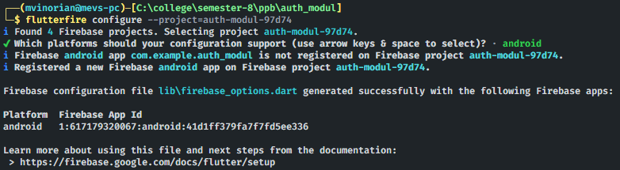
   </div>

4. Install `firebase_core` and `firebase_auth` packages in your Flutter project.

   ```bash
   flutter pub add firebase_core
   flutter pub add firebase_auth
   ```

5. Change `main.dart` file to use the Firebase project.

   ```dart
   import 'package:firebase_core/firebase_core.dart';
   import 'firebase_options.dart';

   void main() async {
      WidgetsFlutterBinding.ensureInitialized();
      await Firebase.initializeApp(
         options: DefaultFirebaseOptions.currentPlatform,
      );
      runApp(const MyApp());
   }
   ```

## Set Up Firebases Authentication

After creating a Firebase project, you need to set up Firebase Authentication. To do this, follow these steps:

1. Go to the [Firebase Console](https://console.firebase.google.com/).

2. Select your project.

3. Go to the "Authentication" section.

4. Click on "Get Started".

5. Click on "Sign-in method".

   <div align="center">
      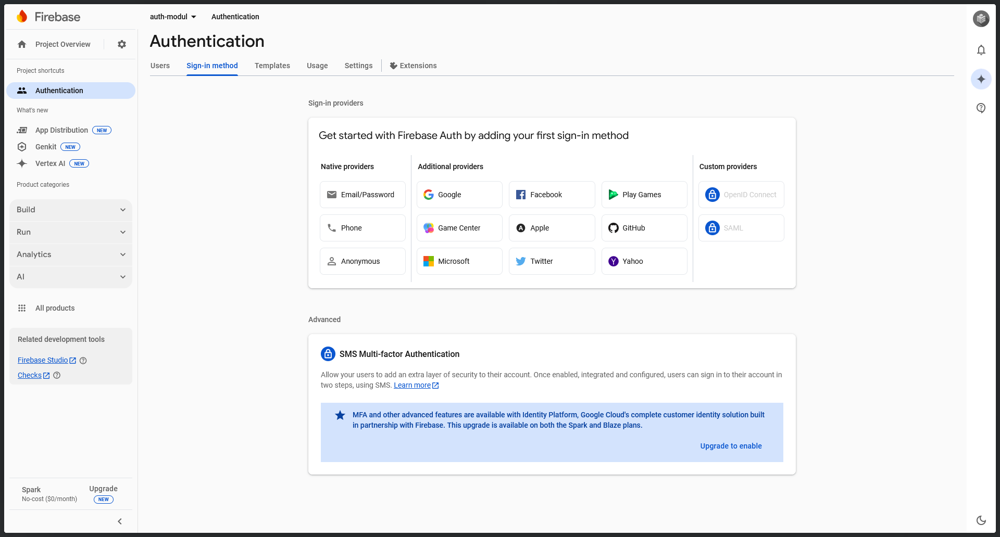
   </div>

6. Enable Email/Password authentication.

   <div align="center">
      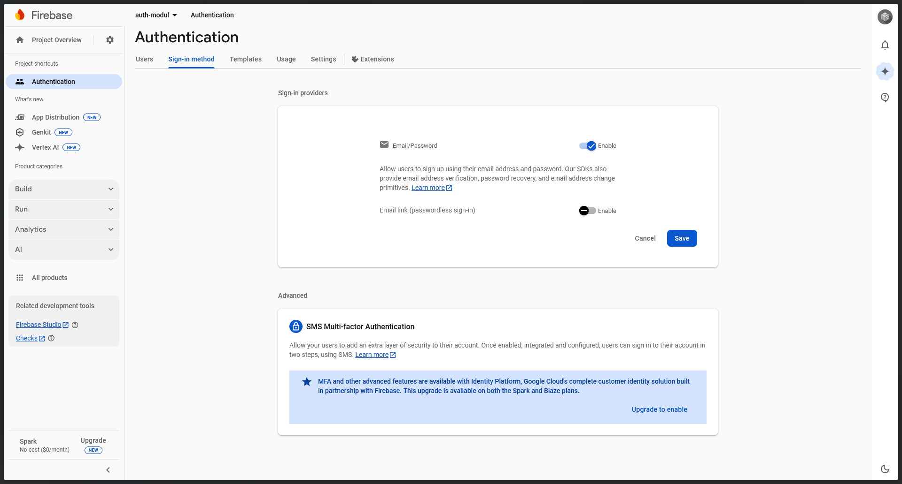
      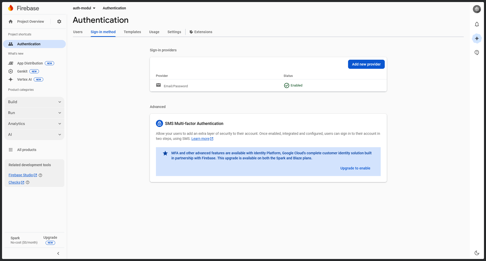
   </div>

7. Click on "Save".

## Flutter Implementation

We will create a simple UI for authentication using Flutter. The UI will have three screens, one for login, one for registration, and one for account information.

### Login Screen

To login into an authenticated user, we can use `signInWithEmailAndPassword()` function from Firebase Auth.

Create a new file `login.dart` in the `lib/screens` directory and add the following code:

```dart
import 'package:firebase_auth/firebase_auth.dart';
import 'package:flutter/material.dart';

class LoginScreen extends StatefulWidget {
  const LoginScreen({super.key});

  @override
  State<LoginScreen> createState() => _LoginScreenState();
}

class _LoginScreenState extends State<LoginScreen> {
  final _emailController = TextEditingController();
  final _passwordController = TextEditingController();

  bool _isLoading = false;
  String _errorCode = "";

  void navigateRegister() {
    if (!context.mounted) return;
    Navigator.pushReplacementNamed(context, 'register');
  }

  void navigateHome() {
    if (!context.mounted) return;
    Navigator.pushReplacementNamed(context, 'home');
  }

  void signIn() async {
    setState(() {
      _isLoading = true;
      _errorCode = "";
    });

    try {
      await FirebaseAuth.instance.signInWithEmailAndPassword(
        email: _emailController.text,
        password: _passwordController.text,
      );
      navigateHome();
    } on FirebaseAuthException catch (e) {
      setState(() {
        _errorCode = e.code;
      });
    }

    setState(() {
      _isLoading = false;
    });
  }

  @override
  Widget build(BuildContext context) {
    return Scaffold(
      appBar: AppBar(
        title: const Text('Login'),
        centerTitle: true,
      ),
      body: Padding(
        padding: const EdgeInsets.all(16.0),
        child: Center(
          child: ListView(
            children: [
              const SizedBox(height: 48),
              Icon(Icons.lock_outline, size: 100, color: Colors.blue[200]),
              const SizedBox(height: 48),
              TextField(
                controller: _emailController,
                decoration: const InputDecoration(label: Text('Email')),
              ),
              TextField(
                controller: _passwordController,
                obscureText: true,
                decoration: const InputDecoration(label: Text('Password')),
              ),
              const SizedBox(height: 24),
              _errorCode != ""
                  ? Column(
                      children: [Text(_errorCode), const SizedBox(height: 24)])
                  : const SizedBox(height: 0),
              OutlinedButton(
                onPressed: signIn,
                child: _isLoading
                    ? const CircularProgressIndicator()
                    : const Text('Login'),
              ),
              Row(
                mainAxisAlignment: MainAxisAlignment.center,
                children: [
                  const Text('Don\'t have an account?'),
                  TextButton(
                    onPressed: navigateRegister,
                    child: const Text('Register'),
                  )
                ],
              )
            ],
          ),
        ),
      ),
    );
  }
}
```

### Registration Screen

The registration screen will be the same as the login screen, but we will use `createUserWithEmailAndPassword()` function from Firebase Auth.

Create a new file `register.dart` in the `lib/screens` directory and add the following code:

```dart
import 'package:firebase_auth/firebase_auth.dart';
import 'package:flutter/material.dart';

class RegisterScreen extends StatefulWidget {
  const RegisterScreen({super.key});

  @override
  State<RegisterScreen> createState() => _RegisterScreenState();
}

class _RegisterScreenState extends State<RegisterScreen> {
  final _emailController = TextEditingController();
  final _passwordController = TextEditingController();

  bool _isLoading = false;
  String _errorCode = "";

  void navigateLogin() {
    if (!context.mounted) return;
    Navigator.pushReplacementNamed(context, 'login');
  }

  void navigateHome() {
    if (!context.mounted) return;
    Navigator.pushReplacementNamed(context, 'home');
  }

  void register() async {
    setState(() {
      _isLoading = true;
      _errorCode = "";
    });

    try {
      await FirebaseAuth.instance.createUserWithEmailAndPassword(
        email: _emailController.text,
        password: _passwordController.text,
      );
      navigateLogin();
    } on FirebaseAuthException catch (e) {
      setState(() {
        _errorCode = e.code;
      });
    }

    setState(() {
      _isLoading = false;
    });
  }

  @override
  Widget build(BuildContext context) {
    return Scaffold(
      appBar: AppBar(
        title: const Text('Register'),
        centerTitle: true,
      ),
      body: Padding(
        padding: const EdgeInsets.all(16.0),
        child: Center(
          child: ListView(
            children: [
              const SizedBox(height: 48),
              Icon(Icons.lock_outline, size: 100, color: Colors.blue[200]),
              const SizedBox(height: 48),
              TextField(
                controller: _emailController,
                decoration: const InputDecoration(label: Text('Email')),
              ),
              TextField(
                controller: _passwordController,
                obscureText: true,
                decoration: const InputDecoration(label: Text('Password')),
              ),
              const SizedBox(height: 24),
              _errorCode != ""
                  ? Column(
                      children: [Text(_errorCode), const SizedBox(height: 24)],
                    )
                  : const SizedBox(height: 0),
              OutlinedButton(
                onPressed: register,
                child: _isLoading
                    ? const CircularProgressIndicator()
                    : const Text('Register'),
              ),
              Row(
                mainAxisAlignment: MainAxisAlignment.center,
                children: [
                  const Text('Already have an account?'),
                  TextButton(
                    onPressed: navigateLogin,
                    child: const Text('Login'),
                  )
                ],
              )
            ],
          ),
        ),
      ),
    );
  }
}
```

### Account Information Screen

To synchronize the authentication state, we can use `authStateChanges()` stream from Firebase Auth. This stream will notify us whenever the authentication state changes. To logout the authenticated user, we can use `signOut()` function from Firebase Auth.

Create a new file `home.dart` in the `lib/screens` directory and add the following code:

```dart
import 'package:auth_modul/screens/login.dart';
import 'package:firebase_auth/firebase_auth.dart';
import 'package:flutter/material.dart';

class HomeScreen extends StatelessWidget {
  const HomeScreen({super.key});

  void logout(context) async {
    await FirebaseAuth.instance.signOut();
    Navigator.pushReplacementNamed(context, 'login');
  }

  @override
  Widget build(BuildContext context) {
    return StreamBuilder<User?>(
      stream: FirebaseAuth.instance.authStateChanges(),
      builder: (context, snapshot) {
        if (snapshot.hasData) {
          return Scaffold(
            appBar: AppBar(
              title: const Text('Account Information'),
              centerTitle: true,
            ),
            body: Center(
              child: Column(
                mainAxisAlignment: MainAxisAlignment.center,
                children: [
                  Text('Logged in as ${snapshot.data?.email}'),
                  const SizedBox(height: 24),
                  OutlinedButton(
                    onPressed: () => logout(context),
                    child: const Text('Logout'),
                  )
                ],
              ),
            ),
          );
        } else {
          return const LoginScreen();
        }
      },
    );
  }
}
```

### Main File

Finally, we need to update the `main.dart` file to include the new screens.

```dart
import 'package:auth_modul/screens/home.dart';
import 'package:auth_modul/screens/login.dart';
import 'package:auth_modul/screens/register.dart';
import 'package:flutter/material.dart';
import 'package:firebase_core/firebase_core.dart';
import 'firebase_options.dart';

void main() async {
  WidgetsFlutterBinding.ensureInitialized();
  await Firebase.initializeApp(
    options: DefaultFirebaseOptions.currentPlatform,
  );
  runApp(const MyApp());
}

class MyApp extends StatelessWidget {
  const MyApp({super.key});

  @override
  Widget build(BuildContext context) {
    return MaterialApp(initialRoute: 'login', routes: {
      'home': (context) => const HomeScreen(),
      'login': (context) => const LoginScreen(),
      'register': (context) => const RegisterScreen(),
    });
  }
}
```

These are the result of the authentication module. You can now run the app and test the authentication functionality.

<div align="center">
   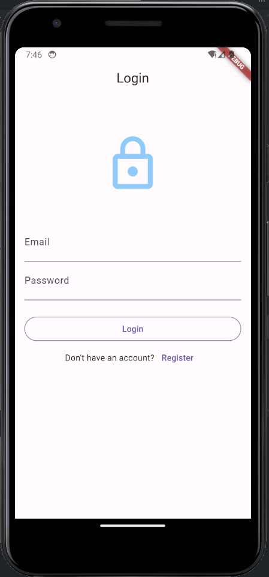
   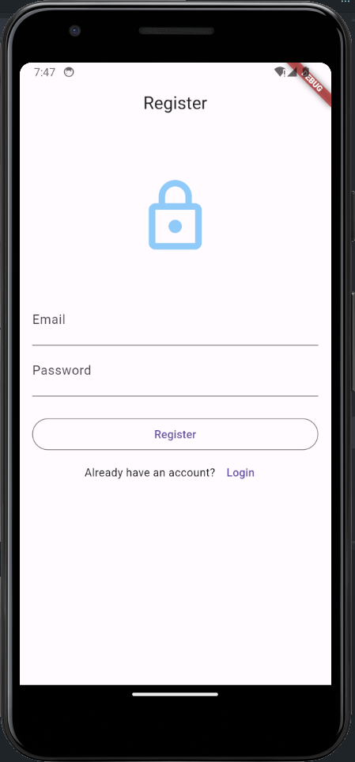
   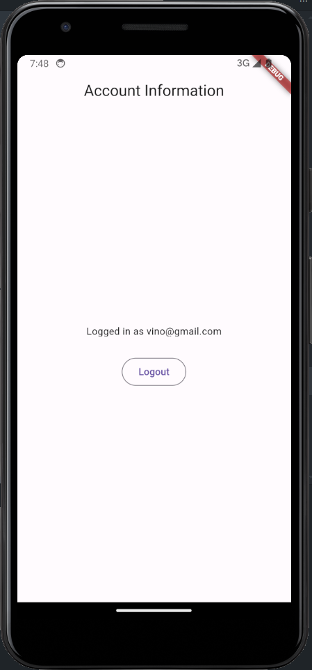
</div>

## User Management

We can manage users using Firebase Console. To do this, follow these steps:

1. Go to the [Firebase Console](https://console.firebase.google.com/).

2. Select your project.

3. Go to the "Authentication" section.

4. Click on "Users".

5. You can add, edit, or delete users from this section.

   <div align="center">
      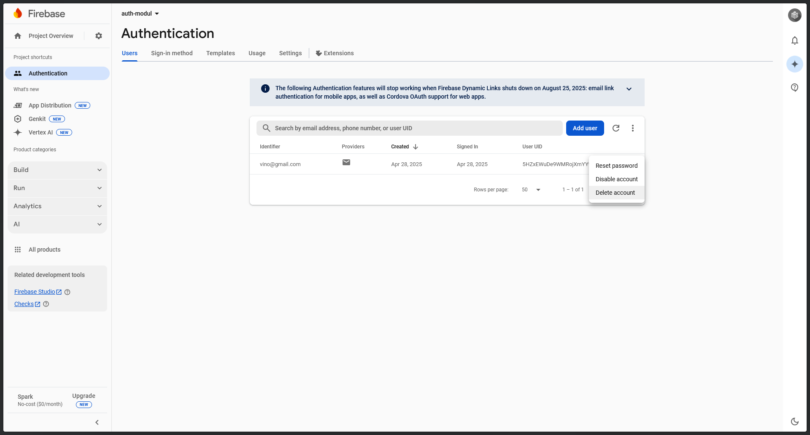
   </div>
